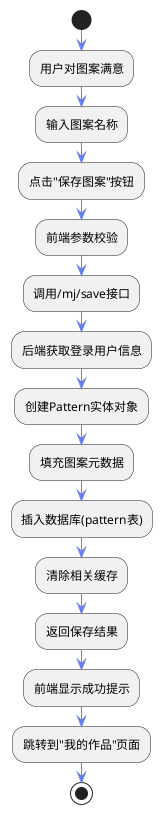

# 智能创作模块

## 3.2 图案智能创作模块

### 3.2.1 Midjourney智能创作

#### （1）流程图
```plantuml
@startuml
skinparam backgroundColor white
skinparam arrowColor #667eea
skinparam rectangle {
  BackgroundColor #f5f5f5
  BorderColor #667eea
  FontColor #333333
}
skinparam diamond {
  BackgroundColor #e6f3ff
  BorderColor #667eea
  FontColor #333333
}
skinparam circle {
  BackgroundColor #e8f5e8
  BorderColor #4caf50
  FontColor #333333
}

start
:用户访问智能创作页面;
diamond:是否已登录?;
branch 未登录
  :显示登录提示;
  :跳转登录页;
  stop
end branch
branch 已登录
  :加载用户信息;
  :初始化页面;
  :用户输入创意描述;
  :选择辅助标签(风格/季节/受众);
  :点击"智能生成"按钮;
  :前端参数校验;
  :调用/mj/imagine接口;
  :后端提示词优化;
  :调用Midjourney API生成图片;
  :返回生成结果;
  :显示4张候选图案;
  diamond:选择操作类型;
  branch 放大图片
    :调用/mj/action接口(upsample);
    :显示单张高清图片;
    :显示保存表单;
    :点击"保存图案"按钮;
    :调用/mj/save接口;
    :保存到数据库;
    :显示成功提示;
    :跳转到"我的作品"页面;
  end branch
  branch 变体图片
    :调用/mj/action接口(variation);
    :显示新的4张图案;
    :回到选择操作类型;
  end branch
  branch 重新生成
    :调用/mj/action接口(reroll);
    :显示新的4张图案;
    :回到选择操作类型;
  end branch
end branch
stop
@enduml
```

#### （2）输入项
| 输入项 | 类型 | 格式 | 约束 |
|--------|------|------|------|
| 创意描述 | 文本 | 字符串 | 支持中文，最多1000字 |
| 风格标签 | 枚举 | 单选 | 简约、可爱、复古、卡通、抽象、民族、未来、写实、手绘 |
| 季节标签 | 枚举 | 单选 | 春季、夏季、秋季、冬季、四季 |
| 受众标签 | 枚举 | 单选 | 儿童、青少年、成人、中老年、通用 |
| 操作类型 | 枚举 | 单选 | upsample(放大)、variation(变体)、reroll(重新生成) |
| 图案名称 | 文本 | 字符串 | 保存时必填，自动生成默认名称 |

#### （3）输出项
| 输出项 | 类型 | 格式 | 说明 |
|--------|------|------|------|
| 生成图案 | 图片 | URL | 2x2网格排列的4张候选图案 |
| 高清图案 | 图片 | URL | 放大后的单张高清图案 |
| 变体图案 | 图片 | URL | 基于选中图案生成的4张变体图案 |
| 保存结果 | 布尔值 | JSON | 图案保存成功状态和图案ID |
| 错误信息 | 文本 | 字符串 | 生成失败、网络超时等错误提示 |

#### （4）算法描述
智能图案生成算法主要包含以下核心步骤：
1. **用户输入处理**：接收用户的创意描述和辅助标签，进行参数校验
2. **提示词优化**：将中文描述翻译为英文，添加服装专业前缀，融合风格、季节、受众信息
3. **AI生成调用**：调用Midjourney API生成4张候选图案，返回图片URL
4. **迭代优化**：支持放大、变体、重新生成三种操作，实现无限次迭代优化
5. **结果保存**：将满意的高清图案保存到数据库，记录图案元数据
6. **异常处理**：处理生成失败、网络超时、API额度不足等异常情况

### 3.2.2 无限迭代优化（核心创新功能）

#### （1）流程图
```plantuml
@startuml
skinparam backgroundColor white
skinparam arrowColor #667eea
skinparam rectangle {
  BackgroundColor #f5f5f5
  BorderColor #667eea
  FontColor #333333
}
skinparam diamond {
  BackgroundColor #e6f3ff
  BorderColor #667eea
  FontColor #333333
}
skinparam circle {
  BackgroundColor #e8f5e8
  BorderColor #4caf50
  FontColor #333333
}

start
:显示当前生成结果;
diamond:判断结果类型;
branch 4张候选图案
  :显示放大/变体/重新生成按钮;
  diamond:选择操作;
  branch 放大图片
    :调用/mj/action接口(upsample);
    :显示单张高清图片;
    :显示变体按钮和保存按钮;
  end branch
  branch 变体图片
    :调用/mj/action接口(variation);
    :显示新的4张图案;
    :回到判断结果类型;
  end branch
  branch 重新生成
    :调用/mj/action接口(reroll);
    :显示新的4张图案;
    :回到判断结果类型;
  end branch
end branch
branch 单张高清图片
  :显示变体按钮和保存按钮;
  diamond:选择操作;
  branch 变体图片
    :调用/mj/action接口(variation);
    :显示新的4张图案;
    :回到判断结果类型;
  end branch
  branch 保存图案
    :调用/mj/save接口;
    :保存到数据库;
    :显示成功提示;
    :跳转到"我的作品"页面;
  end branch
end branch
stop
@enduml
```

#### （2）输入项
| 输入项 | 类型 | 格式 | 约束 |
|--------|------|------|------|
| 任务ID | 文本 | 字符串 | 系统自动生成，唯一标识 |
| 图片ID | 文本 | 字符串 | 系统自动生成，唯一标识 |
| 操作类型 | 枚举 | 单选 | upsample(放大)、variation(变体)、reroll(重新生成) |
| 图片索引 | 数字 | 整数 | 1-4，标识要操作的图片 |
| 图案名称 | 文本 | 字符串 | 保存时必填，最多50字 |

#### （3）输出项
| 输出项 | 类型 | 格式 | 说明 |
|--------|------|------|------|
| 迭代结果 | 图片 | URL | 单张高清图片或4张变体图案 |
| 操作状态 | 布尔值 | JSON | 操作成功或失败状态 |
| 任务ID | 文本 | 字符串 | 新的任务ID，用于后续操作 |
| 图片ID | 文本 | 字符串 | 新的图片ID，用于后续操作 |
| 错误信息 | 文本 | 字符串 | 操作失败时的错误提示 |

#### （4）算法描述
无限迭代优化算法主要包含以下核心步骤：
1. **结果类型判断**：自动识别当前结果是4张候选图案还是单张高清图片
2. **操作类型选择**：根据结果类型动态显示可用的操作按钮
3. **API调用**：根据用户选择的操作类型调用相应的Midjourney API
4. **状态管理**：维护任务ID和图片ID，确保连续操作的正确性
5. **结果更新**：将新生成的结果显示在页面上，保持同一页面无跳转
6. **无限循环支持**：允许用户反复进行变体和放大操作，直到满意为止
7. **保存机制**：提供保存按钮，允许用户随时将满意的结果保存到数据库

### 3.2.3 图案保存与管理

#### （1）流程图


#### （2）输入项
| 输入项 | 类型 | 格式 | 约束 |
|--------|------|------|------|
| 图案名称 | 文本 | 字符串 | 必填，最多50字 |
| 原始提示词 | 文本 | 字符串 | 必填，最多1000字 |
| 风格标签 | 枚举 | 字符串 | 必填 |
| 季节标签 | 枚举 | 字符串 | 必填 |
| 受众标签 | 枚举 | 字符串 | 必填 |
| 任务ID | 文本 | 字符串 | 必填，唯一标识 |
| 图片ID | 文本 | 字符串 | 必填，唯一标识 |
| 图片URL | 文本 | URL | 必填，高清图片地址 |
| 原始图片URL | 文本 | URL | 必填，原始生成图片地址 |

#### （3）输出项
| 输出项 | 类型 | 格式 | 说明 |
|--------|------|------|------|
| 保存结果 | 布尔值 | JSON | 保存成功返回true，失败返回false |
| 图案ID | 文本 | 字符串 | 成功保存后返回的图案唯一标识 |
| 错误信息 | 文本 | 字符串 | 保存失败时的错误提示 |

#### （4）算法描述
图案保存与管理算法主要包含以下核心步骤：
1. **参数校验**：检查图案名称、提示词等必填字段是否为空
2. **用户身份验证**：获取当前登录用户的ID，确保图案关联到正确用户
3. **实体对象创建**：创建Pattern实体，填充所有必要的元数据
4. **数据库插入**：将实体对象插入到pattern表中，生成唯一的图案ID
5. **缓存清理**：清除相关缓存，确保图案列表实时更新
6. **结果返回**：返回保存结果和图案ID给前端
7. **页面跳转**：引导用户跳转到"我的作品"页面，方便查看保存的图案

## 3.2.4 AI服装知识问答功能

#### （1）流程图
```plantuml
@startuml
skinparam backgroundColor white
skinparam arrowColor #667eea
skinparam rectangle {
  BackgroundColor #f5f5f5
  BorderColor #667eea
  FontColor #333333
}
skinparam diamond {
  BackgroundColor #e6f3ff
  BorderColor #667eea
  FontColor #333333
}
skinparam circle {
  BackgroundColor #e8f5e8
  BorderColor #4caf50
  FontColor #333333
}

start
:用户进入AI问答页面;
diamond:是否已登录?;
branch 未登录
  :显示登录提示;
  :点击发送时跳转登录页;
  stop
end branch
branch 已登录
  :加载用户信息;
  :初始化页面;
  :获取常见问题列表;
  :用户选择专业角色;
  :用户输入问题(文字/图片);
  :点击发送按钮;
  :前端构建角色提示词;
  :调用/ai/ask/stream接口;
  :后端参数校验;
  :创建SSE Emitter;
  :异步调用AI服务;
  :流式接收AI回答片段;
  :通过SSE实时返回;
  :前端实时显示AI回答;
  :应用Markdown格式化;
  diamond:是否继续提问?;
  branch 是
    :回到用户输入问题;
  end branch
  branch 否
    diamond:是否切换角色?;
    branch 是
      :选择新角色;
      :回到用户输入问题;
    end branch
    branch 否
      :结束对话;
    end branch
  end branch
end branch
stop
@enduml
```

#### （2）输入项
| 输入项 | 类型 | 格式 | 约束 |
|--------|------|------|------|
| 专业角色 | 枚举 | 单选 | 全能顾问、图案设计、色彩搭配、面料工艺 |
| 问题内容 | 文本 | 字符串 | 1-1000字 |
| 上传图片 | 图片 | Base64/URL | 不超过5MB，支持JPG、PNG格式 |

#### （3）输出项
| 输出项 | 类型 | 格式 | 说明 |
|--------|------|------|------|
| AI回答 | 文本 | Markdown | 包含标题、列表、粗体等格式的专业回答 |
| 流式输出状态 | 布尔值 | SSE | 流式输出的开始、进行中、结束状态 |
| 常见问题列表 | 数组 | JSON | 6个预设的常见问题 |
| 错误信息 | 文本 | 字符串 | 网络异常、未登录、问题过长等错误提示 |

#### （4）算法描述
AI服装知识问答算法主要包含以下核心步骤：
1. **角色设定**：根据用户选择的专业角色，构建相应的角色提示词
2. **问题处理**：接收用户的文字问题和图片（如果有），进行参数校验
3. **AI调用**：使用通义千问大语言模型，支持纯文本和图文混合问答
4. **流式输出**：采用SSE技术，实时返回AI回答片段，提升用户体验
5. **Markdown格式化**：对AI回答进行Markdown渲染，支持标题、列表、粗体等格式
6. **多轮对话支持**：保留对话上下文，支持用户继续提问或切换角色
7. **异常处理**：处理网络异常、AI服务异常、超时等情况，返回友好提示

## 3.2.5 智能创作模块整合

### （1）整体流程图
```plantuml
@startuml
skinparam backgroundColor white
skinparam arrowColor #667eea
skinparam rectangle {
  BackgroundColor #f5f5f5
  BorderColor #667eea
  FontColor #333333
}
skinparam diamond {
  BackgroundColor #e6f3ff
  BorderColor #667eea
  FontColor #333333
}
skinparam circle {
  BackgroundColor #e8f5e8
  BorderColor #4caf50
  FontColor #333333
}

start
:用户访问智能创作平台;
diamond:选择功能模块;
branch 智能图案生成
  :进入Midjourney文生图页面;
  :执行智能图案生成流程;
  :生成并保存图案;
end branch
branch AI服装知识问答
  :进入AI问答页面;
  :执行AI问答流程;
  :获取专业回答;
end branch
stop
@enduml
```

### （2）核心集成点
1. **用户认证**：两个模块共享同一套用户认证系统，确保登录状态一致
2. **AI服务调用**：统一的AI服务调用封装，支持Midjourney、豆包、通义千问等多种AI服务
3. **图片存储**：生成的图案统一存储到腾讯云对象存储，支持CDN加速
4. **数据管理**：所有生成的图案和对话记录统一管理，支持用户在"我的作品"中查看
5. **异常处理**：统一的异常处理机制，返回友好的错误提示

### （3）技术实现要点
1. **前端技术**：Vue 3 + TypeScript + Ant Design Vue，响应式设计支持移动端
2. **后端技术**：Java 17 + Spring Boot 3 + MyBatis-Plus，RESTful API设计
3. **AI集成**：基于商业化API服务，无需自建模型和GPU资源
4. **性能优化**：异步处理、流式输出、缓存机制、图片懒加载
5. **安全性**：登录验证、参数校验、敏感词过滤、频率限制

通过以上设计，智能创作模块为用户提供了从创意生成到专业知识获取的完整解决方案，降低了服装设计门槛，提升了创作效率。