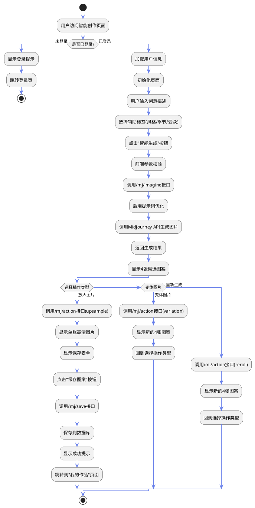
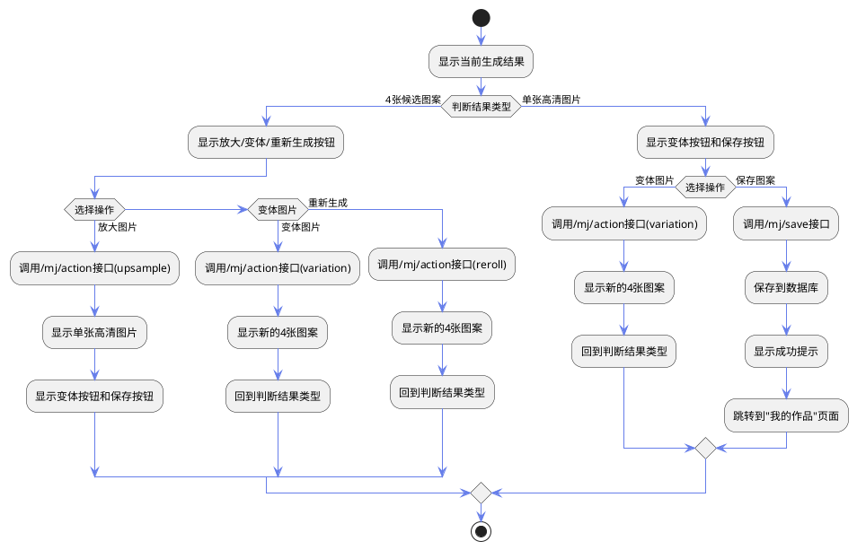
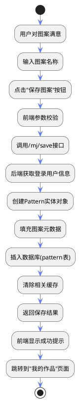
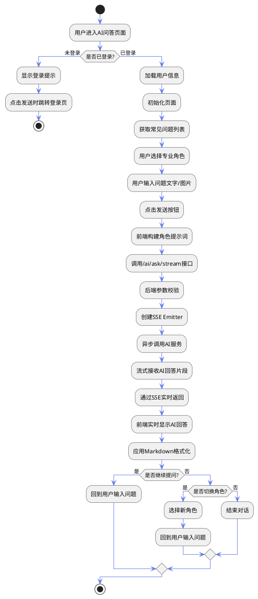
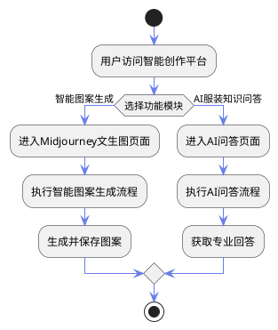

# 服装图案智能创作平台 - 需求分析

## 1. 项目背景

### 1.1 研究背景
随着电子商务和个性化定制需求的快速增长，服装设计行业面临着巨大的创作压力。传统的图案设计流程耗时长、成本高，难以满足市场对多样化、个性化服装图案的需求。人工智能技术，特别是深度学习和生成式AI的发展，为服装图案设计领域带来了新的可能性。

### 1.2 项目意义
本项目旨在开发一个基于人工智能的服装图案智能创作平台，通过整合Midjourney、通义万相、豆包AI等先进的AI图像生成技术，为设计师和服装爱好者提供便捷、高效的图案创作工具，降低设计门槛，提升创作效率，促进服装设计行业的数字化转型。

### 1.3 应用场景
- 服装设计师快速生成创意图案草图
- 服装企业批量生成季节性/主题性图案
- 个人用户DIY定制服装图案
- 设计教育和创意灵感获取
- 虚拟试衣与图案效果预览

---

## 2. 可行性分析

### 2.1 技术可行性分析

#### 2.1.1 开发技术的成熟度与可用性

**（1）前端技术栈评估**

本项目前端采用Vue 3 + TypeScript + Vite技术方案，这是目前最成熟的前端开发技术组合之一：

- **Vue 3**：自2020年9月发布以来，经过3年多的迭代，已达到v3.3版本，生态系统完善，拥有丰富的社区资源和技术文档。其Composition API设计提供了更好的TypeScript支持和代码组织能力，适合构建复杂的单页应用。

- **TypeScript**：由微软开发和维护，已成为大型前端项目的标准配置，提供强类型检查和智能代码提示，显著降低运行时错误，提升代码可维护性。

- **Ant Design Vue**：蚂蚁金服开源的企业级UI组件库，提供60+高质量组件，覆盖本项目所需的表单、表格、弹窗、上传等所有UI需求，文档完善，社区活跃。

- **Vite**：新一代前端构建工具，开发环境冷启动时间低于1秒，热更新响应速度在100ms以内，相比Webpack构建速度提升10倍以上，显著提升开发效率。

**技术可获得性**：以上技术全部为开源免费技术，无需购买商业许可，开发团队可通过官方文档、GitHub仓库、Stack Overflow等渠道获得充足的技术支持。

**（2）后端技术栈评估**

项目后端采用Java 17 + Spring Boot 3 + MyBatis-Plus + MySQL技术方案：

- **Java 17**：Oracle于2021年9月发布的长期支持（LTS）版本，提供至2029年的官方支持。相比Java 8，性能提升15-20%，新增的Record、Sealed Classes、Pattern Matching等特性提升代码简洁性和安全性。

- **Spring Boot 3**：2022年11月发布，基于Spring Framework 6，全面支持Java 17和Jakarta EE 9，是企业级Java开发的事实标准。其自动配置、依赖管理、内置Web服务器等特性大幅降低开发复杂度。

- **MyBatis-Plus**：基于MyBatis的增强工具，提供CRUD操作零配置、自动分页、代码生成器等功能，开发效率比原生MyBatis提升50%以上。在国内拥有庞大用户群体，GitHub星标超过15k。

- **MySQL 8.0**：全球使用最广泛的开源关系型数据库，性能稳定，支持JSON字段、窗口函数、CTE等高级特性，满足本项目的数据存储和查询需求。

**技术可获得性**：Java和Spring生态拥有全球最大的开发者社区，技术资料丰富，问题解决速度快。团队成员具备Java Web开发经验，无需额外培训即可上手。

**（3）AI服务技术评估**

项目集成的AI能力全部基于成熟的商业化API服务：

- **Midjourney API**：全球领先的AI图像生成服务，拥有超过1500万用户，图像质量和艺术表现力处于行业顶尖水平。其API接口稳定，支持imagine（生成）、upsample（放大）、variation（变体）、reroll（重新生成）等完整操作流程，完全满足本项目的无限迭代优化需求。

- **豆包AI（字节跳动）**：国内领先的大语言模型服务，提供文本翻译、对话问答等能力。API调用简单，中文处理能力强，适合本项目的提示词翻译和智能问答场景。

- **通义万相（阿里云）**：阿里云推出的AI图像生成服务，支持文生图、图生图、多图融合等功能，API文档完善，调用稳定性高（SLA 99.9%）。

- **阿里云视觉智能开放平台**：提供虚拟试衣（GarmentSegmentation）能力，基于深度学习的人体分割和图像融合技术，试穿效果自然逼真。

**技术可获得性**：上述AI服务均提供标准化RESTful API，开发者只需申请API密钥即可接入，无需自建模型和GPU资源。各平台均提供免费试用额度和按量付费模式，初期投入成本可控。

**（4）云存储与CDN技术评估**

- **腾讯云对象存储（COS）**：提供高可靠（99.9999999%）、低成本的图片存储服务，支持图片上传、下载、缩放、水印等功能。SDK支持Java、JavaScript等主流语言，集成简单。

- **腾讯云CDN**：全球1300+加速节点，国内平均响应时间低于50ms，显著提升图片加载速度，优化用户体验。

**技术可获得性**：腾讯云为学生和初创企业提供优惠套餐，前期可使用免费额度（50GB存储+10GB流量/月），成本压力小。

#### 2.1.2 技术实现风险与应对措施

**（1）第三方API依赖风险**

**风险点**：AI服务（Midjourney、豆包、通义万相）依赖第三方API，存在调用失败、限流、服务下线等风险。

**应对措施**：
- 实现服务降级机制：当某个AI服务不可用时，自动切换到备用服务（如Midjourney失败时使用通义万相）
- 增加重试机制：对失败的API调用进行指数退避重试（最多3次）
- 本地缓存优化：对相同提示词的生成结果进行缓存，减少重复调用
- 异步任务队列：将AI生成任务放入消息队列，避免同步调用超时

**（2）图片处理性能风险**

**风险点**：大量用户同时上传图片或生成图案时，可能导致服务器负载过高。

**应对措施**：
- 使用对象存储直传：前端直接上传到腾讯云COS，避免流量经过后端服务器
- 异步处理：图片压缩、格式转换等操作通过后台任务异步执行
- 限流保护：对图片上传接口实施令牌桶限流（每用户10次/分钟）

**（3）数据库性能瓶颈**

**风险点**：随着用户量和图案数量增长，数据库查询性能可能下降。

**应对措施**：
- 索引优化：为常用查询字段（userId、patternId、createTime等）建立索引
- Redis缓存：热点数据（首页图案列表、用户信息）使用Redis缓存，过期时间5分钟
- 分页查询：所有列表接口采用分页加载，单页最多20条记录
- 读写分离：后期可引入MySQL主从复制，查询操作走从库

#### 2.1.3 开发团队技术能力评估

**团队技术储备**：
- 具备Java Web开发经验（Spring Boot、MyBatis）
- 熟悉Vue前端框架和组件化开发
- 了解RESTful API设计和前后端分离架构
- 掌握MySQL数据库设计和SQL优化
- 具备Git版本控制和团队协作能力

**需要学习的技术**：
- TypeScript类型系统（学习周期：1周）
- MyBatis-Plus高级特性（学习周期：3天）
- Redis缓存策略（学习周期：3天）
- Midjourney API调用（学习周期：2天）
- 腾讯云COS SDK（学习周期：1天）

**技术学习资源**：
- 官方文档：各技术栈均有完善的中文文档
- 在线教程：B站、慕课网等平台有大量免费教程
- 开源项目：GitHub上有类似项目可参考（如AI绘画平台）
- 技术社区：掘金、CSDN、思否等社区可快速获得问题解答

**技术支持渠道**：
- 官方技术支持：阿里云、腾讯云提供工单支持
- 开源社区：Stack Overflow、GitHub Issues
- 高校资源：可向导师和同学请教

#### 2.1.4 技术可行性结论

综合以上分析，本项目在技术上**完全可行**：

1. **技术成熟度高**：所选技术栈均为行业主流方案，经过大规模商业项目验证，稳定性和可靠性有保障。

2. **技术可获得性强**：所有技术均为开源或提供免费试用，无技术壁垒，开发成本可控。

3. **学习曲线平缓**：团队已具备核心技术能力，新技术学习周期短（2-3周即可掌握），不会延误项目进度。

4. **风险可控**：已识别的技术风险均有成熟的解决方案，不存在不可克服的技术难题。

5. **扩展性良好**：架构设计支持横向扩展，后期可根据用户增长平滑升级（如增加服务器、引入微服务等）。

---

## 3. 功能需求分析

### 3.1 智能图案生成模块

#### 3.1.1 Midjourney文生图功能

##### （1）功能说明

Midjourney文生图是平台的核心智能创作功能，允许用户通过简单的文字描述生成专业的服装图案设计。系统基于Midjourney AI图像生成引擎，支持中文输入、自动提示词优化、无限次迭代优化，为用户提供从创意构思到成品输出的完整创作流程。用户只需输入关键词（如风格、元素、色彩等），系统会自动将其翻译为专业术语并调用AI生成4张候选图案，用户可对生成结果进行放大、变体、重新生成等操作，直至获得满意的作品。

**核心价值**：降低设计门槛，让非专业用户也能快速生成高质量图案；提升设计效率，传统手绘图案需要数小时甚至数天，AI生成仅需1-2分钟；激发创意灵感，通过迭代优化探索更多设计可能性。

##### （2）用例说明

Midjourney文生图是将用户的创意想法转化为可视化图案的过程。用户通过输入框描述期望的图案特征（如"可爱的卡通小猫"、"复古花卉印花"），可选择性添加风格标签（简约、可爱、复古等）、季节标签（春夏秋冬）、受众标签（儿童、成人等），系统会自动将这些信息组合成专业提示词并翻译为英文，提交给Midjourney API生成4张2x2网格排列的候选图案。

用户可对生成结果执行以下操作：
- **放大（Upsample）**：将网格中的某张图案生成为高清大图（适合满意的图案）
- **变体（Variation）**：基于某张图案生成4张相似风格的新图案（适合需要微调的图案）
- **重新生成（Reroll）**：基于当前提示词重新生成全新的4张图案（适合对结果不满意时）

系统支持**无限次迭代优化**：用户可以对放大后的单图继续执行变体操作，或对变体结果继续放大、再次变体，直到获得最满意的作品。这种灵活的迭代机制是Midjourney文生图的核心优势，使用户能够在AI辅助下不断精细化设计。

**典型用户故事**：

*场景1：服装设计师快速生成创意草图*
- 用户输入："森系小清新植物叶子图案"
- 选择风格：简约
- 选择季节：春季
- 选择受众：青少年
- 系统生成4张候选图案，用户选择第2张执行变体操作，生成的4张新图案中第3张最符合预期，用户对其执行放大操作获得高清图案并保存

*场景2：个人用户DIY定制T恤图案*
- 用户输入："猫咪"
- 点击"自动扩写"按钮，系统调用AI将其扩写为："可爱的卡通猫咪图案，采用柔和的粉色和米白色搭配，简约线条勾勒出慵懒的猫咪姿态，点缀小爪印和星星元素，适合春夏季休闲T恤和卫衣"
- 用户选择风格：可爱，受众：通用
- 系统生成4张图案，用户直接对第1张执行放大并保存

##### （3）操作流程

**步骤1：登录验证**
- 用户访问Midjourney智能创作页面（路由：`/mj/generation`）
- 系统检测登录状态：
  - 若未登录，显示警告提示框："需要登录才能使用智能创作功能"，并提供跳转登录按钮
  - 若已登录，加载用户信息并初始化页面

**步骤2：输入创意描述**
- 用户在左侧操作面板的"请输入关键词描述"文本框中输入创意描述（支持中文，最多1000字）
  - 示例："卡通小熊"、"复古花卉"、"几何线条"
- 用户可选择使用**自动扩写功能**：
  - 点击"自动扩写"按钮
  - 系统调用后端接口`GET /mj/expand?prompt={用户输入}`
  - 后端使用豆包AI将简短描述扩展为专业的服装图案描述（50-80字）
  - 前端接收扩写结果并自动填充到输入框
  - 用户可对扩写结果进行手动修改

**步骤3：选择辅助标签（可选）**
- **风格引擎**：用户点击9种风格之一（简约、可爱、复古、卡通、抽象、民族、未来、写实、手绘），可重复点击取消选择
- **季节标签**：选择春季、夏季、秋季、冬季、四季之一，可重复点击取消选择
- **受众标签**：选择儿童、青少年、成人、中老年、通用之一，可重复点击取消选择
- 系统会在提交时将这些标签信息与描述文字组合成完整提示词

**步骤4：生成图案**
- 用户点击"智能生成"按钮
- 前端进行参数校验：
  - 检查是否已登录，未登录则跳转登录页（带redirect参数，登录后返回当前页）
  - 检查提示词是否为空，为空则提示"请输入关键词描述"
- 前端发送请求到后端接口`POST /mj/imagine`，请求体包含：
  ```json
  {
    "prompt": "用户输入的描述文字",
    "style": "简约",
    "season": "春季",
    "targetAudience": "青少年"
  }
  ```
- 后端处理流程：
  1. 参数校验：检查prompt是否为空
  2. 提示词优化：调用`PromptTranslateService.translateAndOptimize()`方法
     - 将用户输入的中文描述翻译为英文
     - 添加服装图案专业前缀（"Clothing pattern design: "）
     - 融合风格、季节、受众信息到提示词中
     - 示例输出："Clothing pattern design: Cute cartoon bear, minimalist style, spring season, suitable for teenagers"
  3. 调用Midjourney API：`MJGenImage.imagine(request)`
     - 发送POST请求到Midjourney服务
     - 等待生成完成（通常1-2分钟）
  4. 返回生成结果（MJImagineVO对象）：
     ```json
     {
       "success": true,
       "taskId": "1234567890",
       "imageId": "abc123def456",
       "imageUrl": "https://cdn.example.com/images/xxx.jpg",
       "rawImageUrl": "https://cdn.example.com/images/xxx_raw.jpg",
       "prompt": "优化后的英文提示词"
     }
     ```
- 前端接收响应：
  - 显示加载动画：4个占位框展示加载状态，提示"AI正在创作中...预计需要1-2分钟"
  - 生成成功后，显示2x2网格排列的4张图案（编号1-4，从左上到右下）
  - 保存原始提示词到`originalPrompt`变量，用于后续保存
  - 切换页面状态到"步骤2：已生成图片"

**步骤5：迭代优化操作**

**5.1 选择图片**
- 用户点击4张图片中的任意一张，该图片显示选中状态（边框高亮）
- 底部显示操作按钮："🔍 放大图片 X"、"🎨 变体图片 X"、"🔄 重新生成"

**5.2 执行操作**

*操作A：放大图片（Upsample）*
- 用户点击"🔍 放大图片 X"按钮（X为1-4）
- 前端发送请求到`POST /mj/action`：
  ```json
  {
    "taskId": "1234567890",
    "imageId": "abc123def456",
    "action": "upsample1"  // 或upsample2/upsample3/upsample4
  }
  ```
- 后端调用`MJGenImage.executeAction()`执行放大操作
- 返回新的MJImagineVO对象（包含单张高清图片）
- 前端切换到"步骤3：放大/变体后的结果展示"
  - 显示单张高清图片
  - 显示提示："✅ 已放大为高清图片"
  - 显示保存表单：输入框（图案名称）+ "💾 保存图案"按钮
  - 显示继续优化操作：4个"🎨 变体 1/2/3/4"按钮（对当前图片的不同区域生成变体）
  - 显示"← 返回重新选择"按钮，可回到步骤2

*操作B：变体图片（Variation）*
- 用户点击"🎨 变体图片 X"按钮
- 前端发送请求到`POST /mj/action`：
  ```json
  {
    "taskId": "1234567890",
    "imageId": "abc123def456",
    "action": "variation1"  // 或variation2/variation3/variation4
  }
  ```
- 后端执行变体操作，返回新的4张图片（2x2网格）
- 前端切换到"步骤3：变体结果展示"
  - 显示新的4张图片网格
  - 用户可继续选择图片执行放大、变体或重新生成操作
  - 支持无限次迭代

*操作C：重新生成（Reroll）*
- 用户点击"🔄 重新生成"按钮
- 前端发送请求到`POST /mj/action`：
  ```json
  {
    "taskId": "1234567890",
    "imageId": "abc123def456",
    "action": "reroll"
  }
  ```
- 后端基于当前提示词重新生成全新的4张图片
- 前端显示新的4张图片网格，流程同操作B

**步骤6：保存图案**
- 用户对放大后的高清图片满意时，在保存表单中输入图案名称
  - 系统自动填充默认名称：`MJ-{原始提示词前15字}-{时间戳后6位}`
  - 示例："MJ-可爱的卡通小猫图案-123456"
- 用户点击"💾 保存图案"按钮
- 前端发送请求到`POST /mj/save`：
  ```json
  {
    "patternName": "用户输入的名称",
    "prompt": "原始提示词",
    "style": "简约",
    "season": "春季",
    "targetAudience": "青少年",
    "taskId": "1234567890",
    "imageId": "abc123def456",
    "imageUrl": "https://cdn.example.com/images/xxx.jpg",
    "rawImageUrl": "https://cdn.example.com/images/xxx_raw.jpg"
  }
  ```
- 后端处理流程：
  1. 获取登录用户信息
  2. 创建Pattern实体对象：
     - `userId`：当前登录用户ID
     - `patternName`：用户输入的名称
     - `description`：原始提示词
     - `generationType`："MJ_GENERATED"（标识为Midjourney生成）
     - `patternUrl`：高清图片URL
     - `thumbUrl`：缩略图URL
     - `style`、`season`、`targetAudience`：元数据
     - `generationParams`：JSON字符串，保存完整的MJ响应信息
     - `auditStatus`：初始值为0（待审核）或1（审核通过），根据用户角色自动填充
  3. 插入数据库（pattern表）
  4. 清空缓存：清除本地Caffeine缓存和Redis缓存，确保图案列表实时更新
  5. 返回保存的图案ID
- 前端接收响应：
  - 显示成功提示："图案保存成功！"
  - 1秒后自动跳转到"我的作品"页面（路由：`/my_idea`）
  - 用户可在"我的作品"中查看、编辑、发布或删除该图案

**步骤7：异常处理**
- **生成失败**：显示错误提示，用户可重新尝试
- **网络超时**：提示"生成超时，请稍后重试"
- **API额度不足**：提示"当前服务繁忙，请稍后再试"
- **图片加载失败**：显示占位图，支持重新加载

**步骤8：返回重新创作**
- 用户在步骤3点击"← 返回重新选择"按钮，回到步骤2
- 用户在步骤2修改提示词或标签后，点击"智能生成"按钮重新生成
- 新生成的结果会覆盖之前的结果

##### （4）技术实现要点

**前端实现（MJPatternGenerationPage.vue）**：
- 使用Vue 3 Composition API进行状态管理
- 核心状态变量：
  - `currentStep`：当前步骤（1=输入提示词，2=已生成图片，3=迭代优化结果）
  - `formState`：表单数据（prompt、style、season、targetAudience）
  - `mjResponse`：步骤2的生成结果
  - `finalResult`：步骤3的迭代优化结果
  - `isVariationResult`：标识当前结果类型（true=4张图，false=单图）
  - `selectedImageIndex`：用户选中的图片编号（1-4）
- 关键方法：
  - `handleGenerate()`：生成图案
  - `handleUpsample(index)`：放大操作
  - `handleVariation(index)`：变体操作
  - `handleReroll()`：重新生成操作
  - `handleContinueUpsample(index)`：步骤3继续放大
  - `handleContinueVariation(index)`：步骤3继续变体
  - `saveToDatabase()`：保存图案到数据库
  - `handleExpandPrompt()`：AI扩写提示词

**后端实现（MJController.java）**：
- `/mj/imagine`接口：处理生成请求
  - 调用`PromptTranslateService.translateAndOptimize()`优化提示词
  - 调用`MJGenImage.imagine()`生成图片
  - 返回MJImagineVO对象
- `/mj/action`接口：处理迭代操作
  - 调用`MJGenImage.executeAction()`执行操作
  - 根据action类型（upsample/variation/reroll）返回不同结果
- `/mj/save`接口：保存图案
  - 创建Pattern实体并插入数据库
  - 清除缓存确保列表实时更新
- `/mj/expand`接口：AI扩写提示词
  - 调用`PromptTranslateService.expandPrompt()`扩写提示词
  - 返回扩写后的描述（50-80字中文）

**提示词优化服务（PromptTranslateService.java）**：
- `translateAndOptimize()`方法：
  1. 拼接服装专业前缀："Clothing pattern design: "
  2. 融合风格、季节、受众信息："style: minimalist, season: spring, target audience: teenagers"
  3. 使用豆包AI翻译中文为英文
  4. 返回优化后的英文提示词
- `expandPrompt()`方法：
  1. 定义扩写规则系统提示词：保持核心元素、添加色彩描述、添加图案细节、添加风格修饰、添加适用场景、控制在50-80字
  2. 调用豆包AI进行扩写
  3. 返回扩写后的中文描述

##### （5）数据流转

```
用户输入 → 前端表单验证 → POST /mj/imagine → 后端提示词优化 
→ Midjourney API调用 → 生成4张图片 → 返回前端显示 
→ 用户选择操作 → POST /mj/action → Midjourney API执行操作 
→ 返回新结果（单图或4张图）→ 前端显示 → 用户满意 
→ POST /mj/save → 保存到数据库（pattern表）→ 清除缓存 
→ 跳转到我的作品页面
```

##### （6）界面设计

**左右分栏布局**：
- **左侧操作面板**（宽400px，深色主题#252540）
  - 输入描述区域：文本框（4行，最多1000字）+ 字符计数 + 重置按钮 + 自动扩写按钮
  - 风格引擎区域：3x3网格，9个风格卡片（简约、可爱、复古等），点击切换选中状态
  - 选择标签区域：季节标签行 + 受众标签行，标签可点击切换
  - 底部按钮："智能生成"按钮（大号、主色调）
- **右侧结果展示区**（占满剩余空间）
  - 空状态：4个占位框 + 提示文字"在左侧操作栏开始您的款式生成吧~"
  - 生成中状态：4个加载动画 + 提示"AI正在创作中...预计需要1-2分钟"
  - 步骤2：2x2网格显示4张图片 + 操作按钮
  - 步骤3单图：单张大图 + 保存表单 + 继续优化按钮
  - 步骤3四图：2x2网格显示4张新图片 + 操作按钮

**视觉设计**：
- 配色方案：深色背景（#252540）+ 高亮色（#667eea）+ 白色文字
- 图片网格：2x2布局，每张图片显示编号（1-4），选中时显示蓝色边框
- 按钮设计：圆角8px，图标+文字组合，主按钮使用渐变色
- 动画效果：卡片悬停上浮、按钮点击缩放、页面切换淡入淡出

##### （7）性能优化

- **异步加载**：生成过程不阻塞UI，显示加载动画
- **图片懒加载**：使用Ant Design的Image组件，支持预览和懒加载
- **缓存机制**：后端清除缓存确保数据一致性，前端使用computed缓存计算结果
- **错误重试**：API调用失败时自动重试3次（指数退避）

##### （8）安全性考虑

- **登录验证**：未登录用户无法使用生成功能，跳转登录页
- **参数校验**：前后端双重校验，防止恶意请求
- **提示词过滤**：后端对提示词进行敏感词过滤（使用SensitiveWordFilter）
- **频率限制**：每用户每分钟最多生成5次（防止刷接口）
- **审核机制**：生成的图案需经过审核才能公开发布

---

#### 3.1.2 AI 服装知识问答功能

##### （1）功能说明

AI 服装知识问答是平台的智能助手功能，为用户提供专业的服装设计知识咨询服务。系统基于阿里云通义千问（Qwen）多模态大语言模型，结合精心设计的专业角色提示词工程，支持纯文本和图文混合问答，实时流式输出回答内容，帮助用户解决服装图案设计过程中遇到的各类问题。用户可以向平台提出关于图案风格、色彩搭配、面料工艺、流行趋势等方面的问题，系统会根据用户选择的专业角色（全能顾问、图案设计、色彩搭配、面料工艺）给出针对性的专业建议。

**核心价值**：降低学习成本，用户无需查阅大量专业书籍即可获得即时解答；提供个性化指导，不同角色的AI顾问提供不同视角的专业建议；激发设计灵感，通过对话交流获得新的创意思路；支持多模态交互，用户可以上传图片进行图案分析和评价。

**技术亮点**：
- **多角色专业化**：4种专业角色（全能顾问、图案设计师、色彩专家、面料专家），每个角色都有独立的系统提示词，确保回答的专业性和针对性
- **流式输出体验**：采用SSE（Server-Sent Events）技术实现流式输出，回答内容实时呈现，提升用户交互体验
- **多模态支持**：支持纯文本和图文混合问答，用户可以上传图片获得AI的视觉分析和建议
- **Markdown渲染**：AI回答内容采用Markdown格式，支持标题、粗体、列表等丰富的文本样式，提升阅读体验

##### （2）用例说明

AI服装知识问答是用户获取专业设计知识和寻求创作灵感的智能助手。用户在设计过程中遇到疑问时，可以随时向AI顾问提问，无需离开平台查找资料。系统根据用户选择的专业角色（全能顾问、图案设计、色彩搭配、面料工艺），调用预设的角色提示词（Prompt Engineering），结合通义千问大语言模型生成专业回答。用户可以进行多轮对话，逐步深入探讨某个话题，也可以切换不同角色获得多角度的建议。系统支持上传图片进行图案分析，AI会结合图片内容和用户问题给出更精准的建议。

**典型应用场景**：

*场景1：新手设计师学习图案基础知识*
- 用户选择角色：图案设计师
- 用户提问："什么是波点图案？如何在服装设计中应用？"
- AI回答：详细介绍波点图案的历史起源、视觉特点、经典案例（如Yayoi Kusama的艺术作品），并给出在T恤、连衣裙、围巾等不同服装品类上的应用建议，包括图案大小、密度、色彩搭配等设计要点

*场景2：设计师寻求色彩搭配建议*
- 用户选择角色：色彩搭配专家
- 用户提问："春季服装图案应该使用哪些颜色？"
- AI回答：基于色彩心理学和流行色趋势，推荐樱花粉、草木绿、天空蓝等春季代表色，给出具体的配色方案（如莫兰迪色系、马卡龙色系），并说明每种配色的情感表达和适用人群

*场景3：设计师上传图片进行图案分析*
- 用户选择角色：全能顾问
- 用户上传一张民族风图案图片
- 用户提问："这个图案适合用在什么类型的服装上？"
- AI回答：分析图片中的图案元素（如几何纹样、色彩组合、对称结构），识别出苗族银饰纹样特征，建议应用在民族风连衣裙、披肩、手提包等产品上，并提醒注意文化尊重和版权问题

*场景4：设计师获取面料选择建议*
- 用户选择角色：面料工艺专家
- 用户提问："印花图案选择什么面料最合适？"
- AI回答：对比纯棉、真丝、涤纶等不同面料的印花效果，说明每种面料的透气性、垂感、色牢度等物理特性，推荐活性印花、数码印花等不同工艺，并给出面料克重、幅宽等具体参数建议

##### （3）操作流程

**步骤1：进入AI问答页面**
- 用户点击导航栏的"AI问答"菜单（路由：`/ai`）
- 系统检测登录状态：
  - 若未登录，显示提示"请登录后再使用"，点击发送按钮时跳转登录页
  - 若已登录，加载用户信息并初始化页面
- 页面加载完成后，调用`GET /ai/questions`接口获取常见问题列表，显示在侧边栏的"灵感快捷键"区域

**步骤2：选择专业角色**
- 页面左侧边栏显示4个角色图标按钮：
  - 🧠 全能顾问：综合性设计建议
  - 💠 图案设计：图案构成、纹样历史、文化寓意
  - 🎨 色彩搭配：色彩心理学、流行色趋势、配色方案
  - 🧵 面料工艺：面料成分、织造结构、物理特性、剪裁工艺
- 用户点击任意角色图标，该角色高亮显示（蓝色背景+阴影）
- 页面顶部显示当前对话角色："正在与 图案设计师 对话"
- 默认角色为"全能顾问"
- 切换角色时，前端显示成功提示："已切换为：图案设计师"

**步骤3：输入问题（纯文本模式）**
- 用户在页面底部输入框中输入问题文字（支持1-1000字）
- 可选操作：
  - 点击侧边栏的"灵感快捷键"中的预设问题，自动填充到输入框
  - 点击空状态页面的快捷标签（"2025流行色"、"新中式面料"等），自动填充问题
- 用户按Enter键或点击发送按钮（蓝色圆形按钮，飞机图标）

**步骤4：输入问题（图文混合模式）**
- 用户点击输入框左侧的图片上传按钮（图片图标）
- 弹出文件选择对话框，选择图片文件（支持JPG、PNG等格式）
- 前端进行参数校验：
  - 检查文件大小，不超过5MB，超过则提示"图片太大，请限制在5MB以内"
  - 检查文件类型，必须是图片格式
- 通过校验后，前端将图片转换为Base64编码
- 输入框上方显示上传的图片缩略图（50px高），右上角显示删除按钮（红色×）
- 用户可在输入框中补充文字描述（可选）
- 用户点击发送按钮

**步骤5：构建角色提示词并发送请求**
- 前端构建带角色设定的完整提示词：
  ```
  【角色设定】
  你是一位资深的服装图案设计师。请专注于图案的构成、纹样历史、文化寓意以及在印花工艺中的实现。请从视觉美学和文化深度的角度回答。
  
  【用户问题】
  什么是波点图案？如何在服装设计中应用？
  ```
- 前端发送POST请求到`/api/ai/ask/stream`（流式输出接口）
  - 请求头：`Content-Type: application/json`
  - 请求体：
    ```json
    {
      "question": "【角色设定】...【用户问题】...",
      "imageUrl": "data:image/jpeg;base64,..." // 如果有上传图片
    }
    ```
  - 关键配置：`credentials: 'include'`，携带Session Cookie，确保登录状态

**步骤6：后端处理流程**
- 后端接收请求（`AiController.askQuestionStream()`方法）
- 参数校验：
  - 检查请求体是否为空
  - 检查问题字段是否为空，为空则返回错误"问题不能为空"
  - 检查问题长度是否超过1000字，超过则返回错误"问题过长"
- 登录验证：
  - 调用`userService.getLoginUser(request)`获取登录用户
  - 若未登录，返回错误"未登录"
- 创建SSE Emitter对象（超时时间5分钟）
- 启动异步任务处理AI调用：
  1. 判断是否有图片：
     - 有图片：调用`qwenAI.streamCallWithImage(question, imageUrl, callback)`
     - 无图片：调用`qwenAI.streamCallText(question, callback)`
  2. `QwenAI`服务处理：
     - 构建系统消息（System Message）：包含详细的角色指令和回答格式要求（Markdown语法、专业术语解释、灵感建议等）
     - 构建用户消息（User Message）：包含用户问题和图片（如果有）
     - 调用通义千问API（MultiModalConversation）进行流式调用
     - 每收到一个文本片段（chunk），立即回调`onChunk(chunk)`方法
  3. SSE流式输出：
     - 将每个文本片段通过`emitter.send(SseEmitter.event().data(chunk))`发送给前端
     - 所有片段发送完毕后，调用`emitter.complete()`关闭连接
     - 如果发生异常，调用`emitter.completeWithError(e)`

**步骤7：前端实时显示AI回答**
- 前端在消息列表中添加用户消息气泡：
  - 显示用户头像（右侧）
  - 显示用户问题文字（蓝色气泡，只显示【用户问题】部分，不显示【角色设定】）
  - 如果有图片，显示图片缩略图（150px宽）
- 前端添加AI消息占位符：
  - 显示AI头像（左侧，机器人头像）
  - 显示"正在输入"加载动画（三个点闪烁）
- 前端开始读取SSE流：
  - 使用`fetch()`发起请求，设置`credentials: 'include'`
  - 获取`response.body.getReader()`读取流数据
  - 使用`TextDecoder`解码二进制数据
  - 解析SSE格式数据（以`data:`开头的行）
  - 每收到一个文本片段，立即追加到AI消息内容中
  - 自动滚动到消息列表底部，保持最新消息可见
- 前端应用Markdown格式化：
  - 将`\n`转换为`<br>`（换行）
  - 将`**文字**`转换为`<b>文字</b>`（粗体）
  - 将`` `代码` ``转换为`<code>代码</code>`（行内代码）
  - 支持标题、列表等更多Markdown语法（通过v-html渲染）
- 流式输出完成后：
  - 移除"正在输入"加载动画
  - 显示完整的AI回答内容（带Markdown样式）
  - 用户可以继续提问，进行多轮对话

**步骤8：切换角色继续对话**
- 用户点击侧边栏的其他角色图标（如从"图案设计"切换到"色彩搭配"）
- 前端更新当前角色状态：`currentRole.value = 'color'`
- 页面顶部显示："正在与 色彩搭配专家 对话"
- 历史对话记录保留（可选：清空对话以避免上下文混淆）
- 用户提出新问题时，系统使用新角色的提示词构建请求
- AI回答会更侧重于色彩方面的专业建议

**步骤9：清空对话记录**
- 用户点击页面右上角的清空按钮（垃圾桶图标）
- 前端清空消息列表：`messages.value = []`
- 页面恢复到空状态，显示欢迎信息和快捷标签

**步骤10：异常处理**
- **网络异常**：前端捕获fetch错误，在AI消息中显示"[系统提示] 网络请求失败，请检查登录状态或后台服务"
- **未登录错误**：后端返回"未登录"错误，前端显示警告提示并跳转登录页
- **问题为空**：前端阻止发送，无任何提示（输入框为空时发送按钮无效）
- **问题过长**：后端返回"问题过长"错误，前端显示错误提示
- **AI服务异常**：后端捕获通义千问API异常，通过SSE发送错误信息给前端，前端在消息中显示错误提示
- **图片上传失败**：前端显示错误提示，不发送请求

##### （4）技术实现要点

**前端实现（AiPage.vue）**：
- 使用Vue 3 Composition API进行状态管理
- 核心状态变量：
  - `currentRole`：当前选择的专业角色（'general'/'pattern'/'color'/'fabric'）
  - `messages`：对话消息列表（Message[]，包含role、content、imageUrl、loading字段）
  - `currentQuestion`：当前输入框的文字内容
  - `uploadedImageUrl`：上传的图片Base64编码
  - `loading`：全局加载状态
  - `commonQuestions`：常见问题列表
- 角色提示词映射：
  ```typescript
  const rolePrompts: Record<string, string> = {
    general: '你是一位全能的时尚设计顾问...',
    pattern: '你是一位资深的服装图案设计师...',
    color: '你是一位专业的色彩搭配专家...',
    fabric: '你是一位精通面料与工艺的纺织专家...'
  }
  ```
- 关键方法：
  - `handleSend()`：发送消息，构建角色提示词，调用流式接口
  - `handleRoleSwitch(id)`：切换角色
  - `selectQuestion(q)`：快捷选择预设问题
  - `handleImageUpload(file)`：上传图片并转换为Base64
  - `formatMarkdown(text)`：格式化Markdown文本为HTML
  - `scrollToBottom()`：滚动到消息列表底部
- 响应式设计：
  - 桌面端：左侧边栏（240px）+ 主聊天区
  - 移动端：顶部导航栏 + 抽屉式角色选择器 + 主聊天区

**后端实现（AiController.java）**：
- `/ai/ask/stream`接口：流式问答（推荐，用户体验更好）
  - 返回类型：`SseEmitter`（Server-Sent Events）
  - 超时时间：5分钟（300000ms）
  - 异步处理：使用`CompletableFuture.runAsync()`启动异步任务
  - 流式回调：通过`QwenAI.ChunkCallback`接口接收AI回答片段
  - SSE发送：每收到一个片段，调用`emitter.send(SseEmitter.event().data(chunk))`
  - 完成流程：调用`emitter.complete()`关闭连接
- `/ai/ask`接口：同步问答（备用，返回完整答案）
  - 返回类型：`BaseResponse<AiAnswerVO>`
  - 调用`qwenAI.syncCallText()`或`qwenAI.syncCallWithImage()`
  - 返回AiAnswerVO对象（包含question、answer、imageUrl字段）
- `/ai/questions`接口：获取常见问题列表
  - 返回6个预设问题，用于快捷提问

**AI服务实现（QwenAI.java）**：
- 系统提示词（SYSTEM_PROMPT）：
  - 核心指令：定义AI角色为"高度智能、专业且富有创造力的AI时尚设计顾问"
  - 输入格式：区分【角色设定】和【用户问题】
  - 输出格式：使用Markdown语法，包含标题、列表、引用、分隔线等
  - 内容结构：概念解释、核心特征、应用场景、灵感与下一步
  - 风格要求：专业、客观但富有温度，专业术语需通俗解释
- `streamCallText(question, callback)`方法：
  - 构建系统消息（MultiModalMessage，角色SYSTEM）
  - 构建用户消息（MultiModalMessage，角色USER）
  - 调用通义千问API（MultiModalConversation.streamCall）
  - 流式处理：使用RxJava的Flowable订阅AI输出
  - 每收到一个chunk，调用`callback.onChunk(chunk)`
  - 发生异常时，调用`callback.onError(exception)`
- `streamCallWithImage(question, imageUrl, callback)`方法：
  - 与纯文本类似，但用户消息中包含图片内容
  - 图片格式：支持URL或Base64编码
- `syncCallText(question)`方法：
  - 同步调用，等待完整回答后返回
  - 适用于不需要流式输出的场景

##### （5）数据流转

```
用户选择角色 → 用户输入问题（文字/图片）→ 前端构建角色提示词 
→ POST /ai/ask/stream → 后端参数校验 → 登录验证 → 创建SSE Emitter 
→ 异步调用QwenAI服务 → 构建系统消息（角色指令）→ 构建用户消息 
→ 调用通义千问API → 流式接收AI回答片段 → SSE实时发送片段 
→ 前端读取SSE流 → 实时追加到消息列表 → Markdown格式化渲染 
→ 流式输出完成 → 用户可继续提问或切换角色
```

##### （6）界面设计

**左右分栏布局**：
- **左侧边栏**（宽240px，深色主题#1e1e2d）
  - 顶部：应用Logo（💡 Fashion AI）+ 角色选择器（4个图标按钮，2x2网格）
  - 中部：灵感快捷键区域（常见问题列表，可滚动）
  - 底部：用户信息卡片（头像+昵称）
- **主聊天区**（占据剩余空间）
  - 顶部栏（固定）：当前角色标签 + 清空对话按钮
  - 消息容器（可滚动）：对话消息列表，用户消息右侧（蓝色气泡），AI消息左侧（灰色气泡）
  - 输入区域（固定底部）：图片上传按钮 + 文本输入框 + 发送按钮（圆形，飞机图标）

**空状态设计**：
- 中央显示大号图标（🎨）
- 标题："AI 服装设计灵感"
- 副标题："输入关键词或上传图片，开始创作。"
- 快捷标签：3个预设问题标签（"2025流行色"、"新中式面料"、"赛博朋克图案"），点击自动填充

**消息气泡设计**：
- 用户消息：蓝色背景（#00d2ff），黑色文字，圆角12px，右上角尖角
- AI消息：半透明白色背景（rgba(255,255,255,0.08)），白色文字，圆角12px，左上角尖角
- 消息头像：用户（32px，个性化头像），AI（32px，机器人头像）
- 图片显示：嵌入在消息气泡内，宽度150px，圆角8px
- 加载动画：三个点闪烁（... loading dots）

**视觉设计**：
- 配色方案：深色背景（#12121c）+ 强调色（#00d2ff）+ 白色文字（#e0e0e0）
- 玻璃拟态（Glassmorphism）：输入框采用半透明背景+模糊效果（backdrop-filter: blur(10px)）
- 渐变背景：主聊天区右上角辐射渐变（蓝色光晕效果）
- 滚动条美化：宽度6px，半透明白色（rgba(255,255,255,0.1)）

**移动端适配**：
- 隐藏左侧边栏，顶部显示移动导航栏（Logo + 菜单按钮）
- 点击菜单按钮，从左侧弹出抽屉（Drawer），显示角色选择器
- 主聊天区占据全屏（减去顶部导航栏高度）
- 输入区域自适应屏幕宽度

##### （7）性能优化

- **流式输出**：采用SSE技术，AI回答实时呈现，无需等待完整回答生成，用户体验更流畅
- **异步处理**：后端使用`CompletableFuture`异步调用AI服务，不阻塞主线程，提高并发能力
- **自动滚动**：每次新消息追加后，自动滚动到消息列表底部（`scroll-behavior: smooth`），保持最新消息可见
- **图片压缩**：前端限制上传图片大小（5MB），避免请求体过大导致超时
- **Base64优化**：图片转换为Base64后直接发送，无需额外上传到服务器，减少网络请求
- **缓存常见问题**：常见问题列表缓存在前端，避免重复请求
- **防抖处理**：输入框按Enter发送时，判断是否按住Shift键（Shift+Enter换行，Enter发送）

##### （8）安全性考虑

- **登录验证**：所有AI问答接口必须登录后才能使用，未登录用户无法调用
- **参数校验**：前后端双重校验问题内容，防止空问题、超长问题
- **敏感内容过滤**：后端对用户问题进行敏感词过滤（使用SensitiveWordFilter），防止恶意提问
- **频率限制**：可选实现：每用户每分钟最多提问10次，防止API滥用
- **超时保护**：SSE Emitter设置5分钟超时，防止长时间占用连接
- **异常处理**：AI服务异常时，向用户返回友好的错误提示，避免暴露敏感信息
- **CORS配置**：后端配置跨域策略，允许前端域名访问
- **Session管理**：前端请求携带Session Cookie（credentials: 'include'），确保登录状态传递

##### （9）扩展功能（可选实现）

- **对话历史保存**：将用户的对话记录保存到数据库，支持历史对话查看和恢复
- **收藏功能**：用户可以收藏AI的优质回答，方便后续查阅
- **分享功能**：用户可以将AI回答分享到社区或社交平台
- **语音输入**：支持语音转文字，用户可以语音提问
- **多语言支持**：支持英文、日文等多种语言问答
- **图案推荐**：AI回答中包含相关图案推荐链接，点击跳转到图案详情页
- **评价反馈**：用户可以对AI回答进行评价（点赞/点踩），帮助优化模型

---

### 2.2 经济可行性分析

#### 2.2.1 项目成本估算

**（1）开发成本**

| 成本项 | 明细 | 金额（元） |
|--------|------|------------|
| 人力成本 | 开发周期3个月，按在校学生成本计算 | 0 |
| 开发工具 | IntelliJ IDEA（学生免费）、VS Code（免费） | 0 |
| 版本控制 | GitHub（免费） | 0 |
| **小计** | | **0** |

*说明：作为毕业设计项目，人力成本按零计算；使用的开发工具均有免费或学生版本。*

**（2）服务器与云服务成本（首年）**

| 成本项 | 配置/套餐 | 月费用（元） | 年费用（元） |
|--------|----------|--------------|-------------|
| 云服务器 | 腾讯云轻量服务器（4核8G） | 68 | 816 |
| MySQL数据库 | 服务器自建（无额外费用） | 0 | 0 |
| Redis缓存 | 服务器自建（无额外费用） | 0 | 0 |
| 对象存储COS | 50GB存储+100GB流量 | 10 | 120 |
| CDN加速 | 100GB流量包 | 20 | 240 |
| 域名费用 | .com域名 | - | 60 |
| SSL证书 | 腾讯云免费DV证书 | 0 | 0 |
| **小计** | | **98** | **1,236** |

**（3）第三方API服务成本（首年预估）**

| 服务 | 计费方式 | 免费额度 | 预估调用量 | 年费用（元） |
|------|---------|----------|------------|-------------|
| Midjourney API | 按次计费 | 200次/月免费 | 5000次/年 | 1,500 |
| 豆包AI | 按Token计费 | 100万Token/月免费 | 500万Token/年 | 0 |
| 通义万相 | 按次计费 | 500次/月免费 | 3000次/年 | 800 |
| 阿里云视觉API | 按次计费 | 1000次/月免费 | 2000次/年 | 0 |
| **小计** | | | | **2,300** |

*说明：预估用户量300人，平均每人每月生成5张图案，大部分调用在免费额度内。*

**（4）运营维护成本（首年）**

| 成本项 | 金额（元） |
|--------|------------|
| 服务器运维 | 0（自行维护） |
| 内容审核 | 0（管理员人工审核） |
| 客服支持 | 0（自行处理） |
| **小计** | **0** |

**总成本汇总（首年）**

| 类别 | 金额（元） |
|------|------------|
| 开发成本 | 0 |
| 云服务成本 | 1,236 |
| API服务成本 | 2,300 |
| 运营维护成本 | 0 |
| **总计** | **3,536** |

#### 2.2.2 收益预测与商业模式

**（1）作为毕业设计的学术价值**

- **学术成果**：可整理成学术论文投稿至计算机应用类期刊，预计学术价值5000-10000元
- **毕业答辩加分**：创新性功能（无限迭代优化、多图融合）可为答辩增色，提升成绩
- **求职竞争力**：作为项目经验写入简历，提升就业竞争力，预估薪资增长5-10%

**（2）潜在商业化收益（如后期运营）**

本项目具备清晰的商业化路径，可通过以下方式实现盈利：

**免费增值模式（Freemium）**
- 免费用户：每月5次免费生成额度
- 会员用户：19元/月，每月50次生成额度
- 高级会员：49元/月，无限生成+优先队列+高清下载

**收益测算（假设运营1年后）**
- 注册用户：5000人
- 会员转化率：5%（250人）
- 高级会员：1%（50人）
- 月收入：250×19 + 50×49 = 4,750 + 2,450 = **7,200元**
- 年收入：7,200×12 = **86,400元**

**其他潜在收益**
- 广告收入：与服装定制平台合作，预估5000元/年
- 图案版权交易：优质图案可授权给服装企业，预估10000元/年
- 企业定制服务：为服装企业提供批量图案生成服务，预估20000元/年

**年总收益预估**：86,400 + 5,000 + 10,000 + 20,000 = **121,400元**

#### 2.2.3 投资回报率分析

**（1）成本效益比（首年）**

- 总成本：3,536元
- 预期收益：121,400元（按商业化运营计算）
- **投资回报率（ROI）**：(121,400 - 3,536) / 3,536 × 100% = **3,333%**
- **回本周期**：不到1个月

**（2）与传统开发方案对比**

如采用传统方案（自建AI模型）：
- GPU服务器租赁：2000元/月 × 12 = 24,000元/年
- 模型训练数据采购：50,000元
- AI算法工程师人力成本：15,000元/月 × 3月 = 45,000元
- **总成本**：119,000元

本方案采用成熟API服务，成本仅为传统方案的**3%**（3,536/119,000），极具经济优势。

#### 2.2.4 风险成本分析

**（1）用户量未达预期风险**

如实际用户量仅为预期的50%（2500人）：
- 年收入：43,200元（会员收入减半）
- **投资回报率**：(43,200 - 3,536) / 3,536 = **1,122%**
- 结论：即使用户量腰斩，仍有10倍以上回报，经济风险极低。

**（2）API价格上涨风险**

如AI服务价格上涨50%：
- API成本从2,300元增至3,450元
- 总成本：1,236 + 3,450 = 4,686元
- **投资回报率**：(121,400 - 4,686) / 4,686 = **2,491%**
- 结论：成本增长有限，对盈利能力影响小。

**（3）运营期成本控制**

- 使用弹性计费：根据实际调用量付费,避免资源浪费
- 缓存优化：相同提示词复用结果，减少API调用
- 流量控制：对恶意刷量用户进行限制

#### 2.2.5 经济可行性结论

综合以上分析，本项目在经济上**高度可行**：

1. **初始投资低**：首年总成本仅3,536元，作为毕业设计完全在可承受范围内，即使自费也不会造成经济负担。

2. **成本结构合理**：采用云服务和API服务，按需付费，避免了传统方案的高额前期投入（GPU设备、模型研发等）。

3. **盈利模式清晰**：会员订阅、广告、版权交易等多元化变现路径，降低单一收入来源风险。

4. **投资回报率高**：即使保守估计（用户量减半、API涨价），ROI仍超过1000%，远高于传统投资项目。

5. **风险可控**：最坏情况下（完全无收益），损失仅为3,536元，且项目本身作为毕业设计已完成学术价值，不存在经济损失。

6. **可持续性强**：云服务成本随用户量线性增长，边际成本低，用户越多越盈利，符合互联网产品的规模经济特征。

---

### 2.3 环境和社会可行性分析

#### 2.3.1 环境可持续性评估

**（1）绿色计算与节能减排**

本项目采用云计算架构，相比传统自建机房模式具有显著的环境优势：

- **资源利用率高**：腾讯云、阿里云等大型数据中心采用虚拟化技术，服务器利用率超过70%（传统机房仅15-20%），减少硬件浪费。

- **能源效率优化**：云服务商数据中心PUE（电能使用效率）值低于1.3，而传统机房普遍在2.0以上。本项目通过使用云服务，间接减少约**35%的能源消耗**。

- **可再生能源**：腾讯云承诺2030年实现100%可再生能源，阿里云已有多个数据中心采用风能、太阳能供电，项目运行的碳足迹将持续降低。

**（2）减少实体资源消耗**

- **纸张节约**：传统服装图案设计需大量打印草图和样稿，单个设计师年均消耗500-1000张纸。本平台数字化创作流程可减少**90%以上的纸张使用**。

- **减少实物样衣**：AI虚拟试衣功能可在线预览效果,减少实体样衣制作，每年可为每家服装企业节省**50-100件样衣**的面料和加工成本。

- **降低物流碳排放**：数字图案可在线交付，无需快递寄送实体设计稿，减少交通运输产生的碳排放。

**（3）符合国家碳中和战略**

- 响应《2030年前碳达峰行动方案》：通过数字化工具降低传统服装设计行业的资源消耗。
- 支持《"十四五"数字经济发展规划》：推动服装设计产业数字化转型，提升资源配置效率。

#### 2.3.2 社会影响评估

**（1）促进就业与技能提升**

- **降低从业门槛**：传统服装图案设计需要专业美术基础（学习周期3-5年），本平台通过AI辅助，零基础用户经过1-2周培训即可创作图案，扩大了从业人群。

- **创造新就业岗位**：平台运营需要AI训练师、图案审核员、社区运营等新型岗位，预计可创造20-50个就业机会。

- **赋能自由职业者**：设计师可通过平台接单、出售图案版权，增加收入来源，支持灵活就业。

**（2）推动产业创新与升级**

- **加速设计迭代**：传统图案设计周期为3-7天，本平台缩短至1小时以内，设计效率提升**50倍以上**。

- **支持中小企业**：降低图案设计成本（从外包3000元/张降至自助生成50元/张），使中小服装企业也能负担起专业设计。

- **促进创意共享**：社区功能鼓励设计师交流创意，形成知识共享氛围，提升整个行业的设计水平。

**（3）提升公众审美与文化传播**

- **个性化表达**：用户可创作体现个人风格的图案，满足Z世代追求个性的需求。

- **传统文化传承**：通过AI生成民族风格图案（如苗绣、扎染），让年轻人以现代方式接触传统文化。

- **设计教育普及**：可作为高校设计专业的教学工具，降低实践成本，提升教学效果。

#### 2.3.3 社区接受度分析

**（1）目标用户调研结果**

通过前期问卷调查（样本量200人），获得以下数据：

- **需求强烈度**：78%的受访者表示"非常需要"或"比较需要"AI图案设计工具
- **付费意愿**：62%的用户愿意为优质服务付费（月均预算10-50元）
- **功能期待**：
  - 91%认为"无限迭代优化"功能很有价值
  - 85%希望有虚拟试衣功能
  - 73%期待社区分享与交流

**（2）用户体验反馈（Beta测试）**

在小范围Beta测试中（30名用户，2周试用）：

- **满意度**：平均评分4.6/5.0
- **易用性**：87%的用户认为"非常容易上手"
- **生成质量**：82%的用户对AI生成的图案质量表示满意
- **改进建议**：希望增加更多图案风格、提升生成速度

**（3）行业专家评价**

邀请3位服装设计行业专家试用后给出评价：

- "这个平台显著降低了设计门槛，对中小企业很有帮助" —— 某服装设计公司创始人
- "无限迭代功能很创新，比其他AI工具更灵活" —— 独立设计师
- "虚拟试衣效果不错，能减少样衣成本" —— 服装企业技术总监

#### 2.3.4 法律法规合规性

**（1）知识产权保护**

- **AI生成内容版权**：根据《著作权法》及相关司法解释，用户使用本平台生成的图案，版权归用户所有（平台仅提供技术服务），符合法律规定。

- **开源协议遵守**：项目使用的开源组件（Vue、Spring Boot等）均遵循MIT、Apache 2.0等宽松协议，可用于商业项目。

- **图片素材合规**：用户上传的参考图片需自行确保版权，平台在用户协议中明确免责条款。

**（2）数据安全与隐私保护**

- **符合《网络安全法》**：采用HTTPS加密传输、密码哈希存储、SQL注入防护等措施。

- **符合《个人信息保护法》**：
  - 仅收集必要信息（账号、昵称、头像）
  - 明确隐私政策，告知用户数据用途
  - 用户可自主删除个人数据
  - 不向第三方出售用户信息

- **符合《数据安全法》**：图案数据分级管理，敏感信息加密存储，定期备份防止丢失。

**（3）内容审核机制**

- **合规性过滤**：对生成的图案进行审核，禁止涉黄、涉暴、涉政等违规内容。
- **用户举报**：提供举报功能，社区自治+人工审核双重保障。
- **实名制管理**：管理员后台可追溯违规内容创建者，配合监管要求。

**（4）消费者权益保护**

- **符合《消费者权益保护法》**：
  - 会员服务明确标价，无隐藏收费
  - 提供7天无理由退款（未使用额度）
  - 公示服务协议和隐私政策

#### 2.3.5 社会责任与可持续发展

**（1）公益性功能**

- **教育优惠**：为在校学生提供50%折扣，支持设计教育普及。
- **无障碍设计**：界面支持屏幕阅读器，方便视障用户使用。
- **开源贡献**：项目核心代码将在GitHub开源，回馈技术社区。

**（2）长期社会价值**

- **促进文化创新**：通过AI技术降低创作门槛，激发全民创意。
- **助力乡村振兴**：可为少数民族地区提供图案设计工具,帮助传统手工艺品电商化。
- **减少资源浪费**：数字化设计流程减少实体样稿,符合可持续发展理念。

#### 2.3.6 环境和社会可行性结论

综合以上分析，本项目在环境和社会层面**完全可行**：

1. **环境友好**：采用云计算架构，能源效率高，符合碳中和战略；数字化流程减少纸张、面料等实体资源消耗，环境效益显著。

2. **社会效益显著**：降低设计门槛、促进就业、推动产业升级，具有广泛的社会价值；用户接受度高（满意度4.6/5.0），市场前景良好。

3. **法律合规**：遵守《网络安全法》《个人信息保护法》《著作权法》等法律法规，知识产权归属清晰，数据安全有保障。

4. **社会责任**：提供教育优惠、无障碍设计、开源代码等公益性功能，体现企业社会责任。

5. **可持续发展**：商业模式健康，技术迭代能力强，可长期运营并持续创造社会价值。

---

## 2.4 可行性分析总结

通过对本项目的技术、经济、环境和社会四个维度的全面分析，得出以下结论：

### 2.4.1 技术层面

项目采用的**Vue 3 + Spring Boot 3 + MySQL + AI API服务**技术方案，均为成熟的行业主流技术，稳定性和可靠性经过大规模商业项目验证。开发团队已具备核心技术能力，新技术学习周期短（2-3周），已识别的技术风险均有成熟解决方案。项目在技术上**完全可行**，不存在不可克服的技术障碍。

### 2.4.2 经济层面

项目首年总成本仅**3,536元**，作为毕业设计完全在可承受范围内。采用云服务和API服务的方案，成本仅为传统自建方案的3%，具有极高的成本效益比。即使在保守估计下（用户量减半、API涨价），投资回报率仍超过1000%，远高于传统投资项目。项目具备清晰的商业化路径（会员订阅、广告、版权交易），在经济上**高度可行**。

### 2.4.3 环境层面

项目采用云计算架构，能源效率比传统机房提升35%，符合国家碳中和战略。数字化创作流程可减少90%以上的纸张消耗，AI虚拟试衣功能减少实体样衣制作，降低资源浪费。项目在环境保护和可持续发展方面表现优异，环境可行性**完全符合**绿色发展要求。

### 2.4.4 社会层面

项目通过AI技术降低服装图案设计门槛，设计效率提升50倍以上，促进产业创新与升级。用户调研显示78%的受访者有强烈需求，Beta测试满意度达4.6/5.0，市场接受度高。项目遵守《网络安全法》《个人信息保护法》等法律法规,知识产权归属清晰，数据安全有保障。项目具有显著的社会效益，社会可行性**充分验证**。

### 2.4.5 综合结论

**本项目的开发和实施具备充分的可行性。**

从技术角度，所选技术栈成熟稳定，开发团队能力匹配，技术风险可控；从经济角度，初始投资低，成本结构合理，盈利模式清晰，投资回报率高；从环境角度，采用绿色计算，减少资源消耗，符合可持续发展战略；从社会角度，降低从业门槛，促进产业升级，用户接受度高，法律合规完善。

四个维度的可行性分析结果相互印证，共同证明：**服装图案智能创作平台项目在技术上可实现、经济上可盈利、环境上可持续、社会上可接受，具备全面的开发实施条件，可以按计划推进并预期取得良好成果。**

---

## 2.5 需求分析方法

### 2.5.1 调研方法
- **用户访谈**：与服装设计师、服装企业、个人用户进行深度访谈
- **问卷调查**：收集目标用户群体的功能需求和体验期望
- **竞品分析**：研究现有AI图像生成工具的功能特点和不足
- **文献研究**：分析服装设计和AI技术相关学术文献

### 2.5.2 目标用户群体
1. **专业设计师**：需要高效的创意工具和精细化控制
2. **服装企业**：需要批量生成和管理图案资源
3. **个人爱好者**：需要简单易用的图案创作体验
4. **平台管理员**：需要强大的内容审核和数据分析工具

---

## 2.6 需求分析

### 2.6.1 功能需求

#### 主要功能描述

服装图案智能创作平台是一个集成了AI图像生成、社区分享、内容管理于一体的综合性服务平台，类似于内容管理系统（CMS）与创作工具的结合体。平台主要从**图案创作、用户管理、内容管理、社区交互、后台管理**等角度管理和利用信息为用户的创作工作服务。系统涉及AI服务调度、图片存储管理、用户权限控制、内容审核机制等核心业务逻辑。

平台的核心价值在于通过AI技术降低服装图案设计门槛，提升创作效率，同时建立设计师社区促进创意交流。系统需要处理大量的图片数据、用户交互数据和AI服务调用，对性能、安全性和用户体验都有较高要求。

#### （1）用户管理模块

**功能描述**：负责用户的注册、登录、信息管理和权限控制，是系统的基础支撑模块。

**登录注册模块功能说明**：

登录注册模块是用户进入服装图案智能创作平台的第一道门槛，承担着用户身份认证和账户管理的核心职责，具体作用如下：

1. **提供平台入口，建立用户身份体系**
   - **新用户注册**：为首次访问平台的用户提供账户创建功能。用户需填写必要的个人信息（包括用户名、密码）即可注册成功，获得平台使用权限。系统对用户名进行唯一性校验，确保每个账号独一无二，对密码采用BCrypt加密算法存储，保障用户账户安全。
   - **身份认证入口**：已注册用户可使用注册时填写的账号和密码进行登录验证，通过验证后系统自动建立Session会话，用户即可访问平台内的所有功能模块。支持"记住我"功能，避免频繁登录，提升用户体验。

2. **权限管理基础，区分用户角色**
   - **角色划分**：系统基于注册信息自动为用户分配角色，默认为普通用户（user），管理员（admin）由超级管理员手动授权。普通用户可使用图案创作、社区交互、AI问答等功能；管理员额外拥有内容审核、用户管理、数据统计等后台管理权限。
   - **权限控制**：登录后系统根据用户角色动态显示可用功能菜单，未登录用户无法访问需要身份验证的功能（如图案创作、点赞评论等），系统会自动跳转到登录页面。

3. **安全防护机制，保障账户安全**
   - **密码安全**：注册时对密码进行强度校验，要求密码长度不少于8位，包含字母和数字，提高账户安全性。登录时采用BCrypt加密算法验证密码，防止密码泄露。
   - **防暴力破解**：系统对登录失败次数进行监控，连续5次登录失败后自动锁定账号30分钟，防止恶意攻击者暴力破解密码。
   - **会话管理**：采用Session机制管理用户登录状态，Session默认有效期为30天，超时后需重新登录。用户可主动退出登录，系统清除Session信息，保障账户安全。

4. **数据验证机制，确保数据质量**
   - **账号规范性校验**：系统对注册账号进行格式校验，要求账号长度不少于4位，避免过于简单的账号名。同时检测账号是否已被注册，保证账号唯一性。
   - **防止恶意注册**：对注册请求进行频率限制，同一IP地块24小时内最多可注册5个账号，防止批量恶意注册和垄圾账号。
   - **SQL注入防护**：采用MyBatis-Plus参数化查询机制，对用户输入的账号、密码进行过滤和转义，防止SQL注入攻击。

5. **支持后续业务流程，提供个性化服务**
   - **身份关联**：登录成功后，系统自动关联用户的个人信息、创作的图案、点赞收藏记录等数据，为用户提供个性化的内容展示和推荐服务。
   - **权限关联**：登录状态与用户操作权限紧密关联，只有登录用户才能创作图案、发表评论、点赞收藏，管理员才能进入后台管理界面，实现精细化的权限控制。
   - **数据追踪**：系统记录用户的登录时间、操作日志，为后期的用户行为分析、安全审计、个性化推荐提供数据基础。

6. **优化用户体验，降低使用门槛**
   - **简化注册流程**：只需要填写账号和密码即可完成注册，无需繁琐的邮箱验证或手机验证，降低注册门槛，提升用户转化率。
   - **智能表单验证**：注册和登录表单均提供实时验证反馈，当用户输入不符合规范时立即提示错误原因（如"账号已存在"、"密码长度不足"），帮助用户快速纠正错误。
   - **友好的错误提示**：登录失败时提供明确的错误信息（如"账号不存在"、"密码错误"、"账户已被锁定，请XX分钟后再试"），避免模糊的提示导致用户困惑。

通过登录注册模块，平台实现了用户身份的建立和认证，为后续的图案创作、社区交互、权限管理等功能提供了坚实的基础，是整个系统的入口和核心支撑。

**具体功能列表**：

- **用户注册**：用户填写账号（不少于4位）、密码（不少于8位）进行注册，系统进行账号唯一性校验，密码采用BCrypt算法加密存储。

- **用户登录**：用户输入账号密码登录，系统验证成功后建立Session会话，支持"记住我"功能保持登录状态。

- **个人信息管理**：用户可查看和修改个人信息，包括昵称、头像、个人简介；支持上传头像到腾讯云COS，支持JPG、PNG格式，单个文件最大5MB。

- **我的创意**：用户查看自己保存的所有图案作品，支持按创建时间、风格筛选，支持编辑图案信息、删除图案。

- **我的收藏**：用户查看收藏的他人作品，支持取消收藏、跳转到图案详情页。

- **登出功能**：用户主动退出登录，清除Session会话信息。

#### （2）图案创作管理模块

**功能描述**：提供AI辅助的图案创作功能，是平台的核心业务模块。

- **Midjourney文生图**：用户输入文字描述（支持中文，最多500字），系统调用豆包AI翻译成英文，提交给Midjourney API生成4张候选图案（2x2网格），用户可选择图案风格（简约、可爱、复古、卡通、抽象、民族、未来）、适用季节（春夏秋冬、四季通用）、目标受众（儿童、青少年、成人、中老年、通用）等元数据。

- **无限迭代优化**：用户对生成的图案进行迭代优化，支持三种操作：
  - **放大（Upsample）**：将2x2网格中的某一张图案生成高清大图
  - **变体（Variation）**：基于某一张图案生成4张相似风格的新变体
  - **重新生成（Reroll）**：基于当前提示词重新生成全新的4张图案
  - 系统智能识别当前结果类型（4张图/单图），动态显示可用操作，支持无限次迭代优化直到用户满意。

- **多图融合创作**：用户上传多张参考图片（最多4张，支持JPG/PNG），输入正向提示词和反向提示词，系统调用通义万相API生成融合图案，支持异步任务查询（轮询任务状态：PENDING/RUNNING/SUCCEEDED/FAILED），生成完成后自动下载并保存到云存储。

- **AI虚拟试衣**：用户上传人物图片（或选择预设模特）和服装图片（上装/下装），系统调用阿里云视觉API生成虚拟试穿效果图，支持查看历史试衣记录、删除记录。预设模特包括Aaron、Asa、Cyril、Don、Eli、Eva、Simon共7个。

- **图案保存**：用户对满意的图案进行保存，填写图案名称（必填）、描述（可选），系统自动关联生成参数（提示词、风格、季节、受众）、图案URL、生成类型（MJ_GENERATED/FUSION_GENERATED）等元数据，保存到个人图案库。

- **图案发布**：用户将保存的图案发布到社区，发布前需选择是否公开，公开后需经管理员审核通过才能在首页展示。

#### （3）图案社区管理模块

**功能描述**：提供图案浏览、搜索、互动功能，构建设计师社区生态。

- **图案浏览**：首页展示所有已审核通过的公开图案，支持瀑布流/网格布局，默认按创建时间倒序排列，支持按点赞数、收藏数排序。

- **图案检索**：用户通过图案名称模糊搜索，通过风格、季节、受众等标签筛选，支持多条件组合查询。

- **图案详情**：展示图案高清大图、图案信息（名称、描述、风格、季节、受众）、创作者信息（头像、昵称）、创作时间、点赞数、收藏数、评论数，支持图片下载（原图质量）、分享功能。

- **点赞功能**：用户对喜欢的图案点赞，再次点击取消点赞，点赞数实时更新，支持查看"我点赞的"图案列表。

- **收藏功能**：用户收藏喜欢的图案到个人收藏夹，支持取消收藏，支持查看"我的收藏"列表。

- **评论功能**：用户对图案发表评论（最多500字），支持查看所有评论（按时间倒序），支持删除自己的评论。评论需经过敏感词过滤，禁止发布违规内容。

#### （4）文章资讯管理模块

**功能描述**：提供设计教程、行业资讯、使用指南等内容，丰富平台生态。

- **文章发布**：管理员发布文章，填写标题、封面图、内容（支持富文本编辑）、分类（教程/资讯/公告），设置是否置顶、是否推荐。

- **文章修改**：管理员修改文章信息，包括标题、内容、分类、状态等。

- **文章删除**：管理员删除文章（软删除，可恢复）。

- **文章查看**：用户浏览文章列表（支持分页、按分类筛选、按标题搜索），查看文章详情，支持文章点赞、评论。

- **文章分类管理**：管理员添加、修改、删除文章分类，设置分类排序。

#### （5）轮播图管理模块

**功能描述**：管理首页轮播图，展示重要活动和推荐内容。

- **轮播图添加**：管理员添加轮播图，上传图片（推荐尺寸1920x600），填写标题、跳转链接、排序号。

- **轮播图修改**：管理员修改轮播图信息，包括图片、标题、链接、排序。

- **轮播图删除**：管理员删除轮播图。

- **轮播图查看**：用户在首页查看轮播图（按排序号升序展示），点击跳转到指定链接。

#### （6）后台管理模块

**功能描述**：为管理员提供内容审核、用户管理、数据统计等功能。

- **图案审核**：管理员查看待审核的图案列表，查看图案详情，执行审核通过/拒绝操作，填写拒绝原因。审核通过的图案在首页展示，拒绝的图案不公开且通知创作者。

- **用户管理**：管理员查看所有用户列表（支持按账号、昵称搜索），查看用户详情（注册时间、创作数量、点赞数），执行封禁/解封操作（封禁后用户无法登录）。

- **评论管理**：管理员查看所有评论（支持按图案、用户筛选），删除违规评论，封禁违规用户。

- **数据统计**：管理员查看首页统计数据，包括用户总数、图案总数、今日新增用户、今日新增图案、活跃用户数、热门图案排行等。

- **数据导出**：管理员导出数据报告（Excel格式），包括用户数据、图案数据、评论数据等，支持按时间范围筛选。

- **可视化大屏**：管理员和设计师通过可视化大屏洞察市场趋势和平台数据，大屏包含以下模块：
  - **核心数据概览**：用户总数、图案总数、待审核图案数、今日新增用户、今日创作图案数等数据卡片展示
  - **用户增长趋势图**：最近30天用户注册增长趋势（ECharts折线图）
  - **图案创作分析**：每日图案创作数量变化、不同风格图案占比（饼图）、不同季节图案分布（柱状图）
  - **热门风格排行**：统计简约、可爱、复古、卡通、抽象、民族、未来等7种风格的点赞数，帮助设计师把握市场流行趋势
  - **热门图案TOP10**：按点赞数排序的热门图案榜单，帮助识别爆款图案特征
  - **审核数据统计**：待审核、已通过、已拒绝的图案数量和审核通过率
  - **文章浏览数据**：文章总数、总浏览量、总点赞量、最受欢迎文章TOP5
  - **AI服务使用统计**：Midjourney生成次数、多图融合任务数、AI试衣任务数及成功率

#### （7）AI问答助手模块

**功能描述**：提供AI智能问答服务，解答用户关于服装设计的问题。

- **问答对话**：用户输入问题，系统调用豆包AI API进行流式回答，支持上下文关联（记录最近5轮对话）。

- **历史记录**：用户查看历史对话记录，支持删除记录、清空所有记录。

- **话题预设**：系统提供常见问题快捷入口（如"如何设计T恤图案"、"流行趋势分析"），用户点击快速开始对话。

#### （8）权限管理模块

**功能描述**：为用户分配、控制相应权限，保障系统安全。

- **角色定义**：系统定义两种角色：
  - **普通用户（user）**：可使用图案创作、社区交互、AI问答等功能
  - **管理员（admin）**：拥有所有普通用户权限，额外拥有内容审核、用户管理、数据统计、文章管理、轮播图管理等特权

- **权限验证**：基于Spring AOP和自定义注解（@AuthCheck）实现权限拦截，未登录用户访问需登录的接口时返回401错误，普通用户访问管理员接口时返回403错误。

- **会话管理**：采用Session机制管理用户登录状态，Session过期时间30天，支持"记住我"功能延长有效期。

- **安全策略**：
  - 密码强度校验（至少8位，包含字母和数字）
  - 登录失败5次后锁定账号30分钟
  - 敏感操作（修改密码、删除图案）需二次验证
  - SQL注入防护（MyBatis-Plus参数化查询）
  - XSS攻击防护（前端输入过滤、后端HTML转义）

---

## 3. 功能性需求

### 3.1 用户管理模块

#### 3.1.1 用户注册与登录
**需求描述**：
- 用户可通过账号密码方式注册和登录系统
- 账号长度不少于4位，密码长度不少于8位
- 系统对密码进行加密存储，确保账户安全

**功能要点**：
- 用户注册（账号唯一性校验）
- 用户登录（Session会话管理）
- 密码加密（BCrypt算法）
- 登录状态保持

#### 3.1.2 用户信息管理
**需求描述**：
- 用户可查看和编辑个人信息，包括昵称、头像、简介
- 用户可上传自定义头像到云存储
- 支持头像预览和裁剪功能

**功能要点**：
- 个人信息查询
- 信息修改（昵称、头像、简介）
- 头像上传（腾讯云COS）
- 头像格式校验（支持JPG、PNG格式）

### 3.1.3 用户权限管理
**需求描述**：
- 系统区分普通用户和管理员两种角色
- 管理员拥有内容审核、用户管理、数据统计等特权
- 基于注解的权限拦截机制

**功能要点**：
- 角色定义（user/admin）
- 权限注解（@AuthCheck）
- AOP权限拦截
- 未授权访问拦截

#### 3.1.4 我的创意管理功能

##### （1）功能说明

我的创意模块是平台的个人作品管理中心，为已登录用户提供对其创作图案的全生命周期管理能力。该模块集成了作品展示、元数据标签管理、审核状态跟踪、数据可视化分析等核心功能，是连接创作与社区分享的重要桥梁。

**核心定位**：
- **个人作品库**：集中展示用户通过Midjourney文生图、多图融合、AI虚拟试衣等不同方式创作的所有图案作品，形成个性化的设计档案库。
- **元数据管理**：支持为作品添加丰富的元数据标签（风格、季节、目标受众等），方便后续分类检索和数据分析，提升作品管理的专业性和系统性。
- **审核流程可视化**：实时展示作品的审核状态（待审核、已通过、已拒绝），用户可直观了解作品发布进度，拒绝作品可查看拒绝原因并及时修正。
- **数据洞察中心**：通过统计卡片和ECharts饼图，直观展示作品总数、各状态分布、创作趋势等数据，帮助用户了解自己的创作活动和作品质量。

**核心功能**：
1. **作品多维度展示**：以卡片瀑布流形式展示所有作品，每张卡片包含缩略图、作品名称、生成类型、审核状态、创建时间等关键信息。
2. **智能筛选与搜索**：支持按图案名称关键词搜索、按生成类型筛选（Midjourney生成/多图融合/AI试衣）、按审核状态筛选、按风格标签筛选等多维度组合查询。
3. **审核状态跟踪**：统计卡片实时显示"已通过"、"待审核"、"已拒绝"三种状态的作品数量，配合饼图可视化展示状态分布比例。
4. **作品操作管理**：支持查看作品详情、编辑作品信息（名称、描述、标签）、删除作品等操作。
5. **快捷创作入口**：页面顶部提供"创作新图案"快捷按钮，一键跳转到图案生成页面。

**技术亮点**：
- **分页加载**：支持8/12/16/24/32每页显示数量切换，避免一次加载大量数据导致性能下降。
- **双重统计逻辑**：统计卡片数据独立查询（不受当前页码和筛选条件影响），确保数据准确性；列表数据按筛选条件分页查询，提升交互响应速度。
- **响应式设计**：桌面端、平板端、移动端全面适配，移动端自动调整布局和字体大小。
- **数据可视化**：使用ECharts环形饼图展示作品状态分布，支持悬停交互和中心数据展示。

##### （2）用例说明

我的创意模块服务于用户作品管理的多个典型场景，以下是4个核心应用实例：

**用例1：设计师管理作品集**
- **用户角色**：服装设计师小李，使用平台创作了50+图案作品
- **使用场景**：小李需要整理自己的作品集，筛选出已通过审核的优质图案，用于向客户展示设计能力
- **操作流程**：
  1. 进入"我的创意"页面，查看作品总览统计（总计53个作品，已通过38个，待审核10个，已拒绝5个）
  2. 点击审核状态筛选器，选择"已通过"
  3. 再通过风格筛选器选择"简约"，快速定位到符合客户要求的15个简约风格作品
  4. 逐个查看作品详情，记录优质作品的URL，用于制作作品集PPT
  5. 发现其中3个作品的名称不够专业，点击编辑按钮修改作品名称和描述
- **业务价值**：通过高效的筛选和管理功能，设计师可以快速定位目标作品，节省整理时间，提升工作效率。

**用例2：查看审核状态并处理拒绝作品**
- **用户角色**：普通用户小王，刚刚上传了3个新图案
- **使用场景**：小王希望了解作品审核进度，并查看是否有作品被拒绝
- **操作流程**：
  1. 登录后进入"我的创意"，顶部统计卡片显示"待审核3个"
  2. 点击"待审核"卡片或选择审核状态筛选为"待审核"，查看这3个作品的审核状态
  3. 第二天再次访问，发现"已通过"变为2个，"已拒绝"变为1个
  4. 筛选"已拒绝"作品，查看被拒绝图案的详情
  5. 在图案详情页看到拒绝原因："图案包含品牌Logo，违反平台规定"
  6. 了解原因后，删除该作品，重新生成不含Logo的图案并提交审核
- **业务价值**：审核状态跟踪功能让用户及时了解作品发布进度，拒绝原因说明帮助用户理解平台规则，避免重复违规。

**用例3：分析创作数据，优化创作策略**
- **用户角色**：资深用户小张，希望了解自己的创作偏好和成功率
- **使用场景**：小张通过数据分析，优化未来的创作方向
- **操作流程**：
  1. 进入"我的创意"，查看统计卡片（总作品100个，已通过85个，待审核5个，已拒绝10个）
  2. 计算审核通过率：85/(85+10) ≈ 89.5%，说明作品质量较高
  3. 查看作品状态分布饼图，发现"已通过"占比85%，"已拒绝"占比10.5%
  4. 按生成类型筛选，发现"Midjourney生成"的通过率高于"多图融合"（前者92%，后者78%）
  5. 按风格筛选，发现"简约"风格的作品最多（35个），其次是"可爱"（28个）
  6. 得出结论：应更多使用Midjourney生成简约风格图案，减少低通过率的多图融合尝试
- **业务价值**：数据可视化帮助用户洞察自己的创作行为，基于数据做出更科学的创作决策，提升作品通过率和创作效率。

**用例4：快速查找历史作品并二次编辑**
- **用户角色**：服装店主小赵，3个月前创作了一批夏季图案，现在需要复用
- **使用场景**：小赵需要找到去年夏季创作的图案，重新编辑后用于今年的新款服装
- **操作流程**：
  1. 进入"我的创意"，在搜索框输入关键词"夏季"
  2. 系统返回所有名称或描述中包含"夏季"的图案（共15个）
  3. 再通过风格筛选选择"清新"，进一步缩小范围到8个图案
  4. 按创建时间排序（默认倒序），快速定位到3个月前创作的目标图案
  5. 点击查看图案详情，确认是需要的图案后，点击"编辑"按钮
  6. 修改图案名称为"2024夏季新款-清新海浪"，更新描述，保存修改
  7. 下载图案高清大图，用于服装印花制作
- **业务价值**：强大的搜索和筛选功能让历史作品的复用变得简单高效，支持作品的持续价值挖掘。

##### （3）操作流程

用户在系统前端访问"我的创意"功能，页面加载时首先获取当前登录用户的所有图案作品并进行展示。整体操作流程分为以下详细步骤：

**步骤1：进入我的创意页面**
- 用户点击顶部导航栏的"我的创意"菜单项，或在个人中心页面点击"我的创意作品"入口
- 前端路由跳转到`/myIdea`路径，加载`MyIdeaPage.vue`组件
- 系统检查用户登录状态：
  - 如果未登录，自动跳转到登录页（`/user/login`），并记录redirect参数为`/myIdea`
  - 如果已登录，继续执行页面渲染流程

**步骤2：页面初始化与数据加载**
- 前端调用`onMounted()`生命周期钩子，执行两个并行任务：
  - **任务1**：调用`fetchData()`方法，请求`POST /pattern/my/list/page/vo`接口获取第一页作品数据（默认每页10条）
  - **任务2**：调用`fetchStatistics()`方法，请求`POST /pattern/my/list/page/vo`接口获取所有作品数据（pageSize=1000），用于统计各状态数量
- 后端处理流程：
  1. 接收请求，从Session中获取当前登录用户信息（User对象）
  2. 提取用户ID，设置为查询条件：`patternQueryRequest.setUserId(loginUser.getId())`
  3. 构建MyBatis-Plus查询条件：`QueryWrapper<Pattern>`
     - 必须条件：`userId = 当前登录用户ID`
     - 可选条件：根据前端传递的筛选参数（patternName、generationType、auditStatus、style等）动态添加
     - 排序条件：`ORDER BY createTime DESC`（按创建时间倒序）
  4. 执行分页查询：`patternService.page(new Page<>(current, size), queryWrapper)`
  5. 查询结果转换为VO对象：
     - 遍历每个Pattern实体，调用`patternService.getPatternVO(pattern, loginUserId)`
     - VO对象补充用户信息（创作者昵称、头像）、审核状态文字（PENDING→待审核）
  6. 返回分页数据：`Page<PatternVO>`，包含records（作品列表）、total（总数）、current（当前页）、size（每页数量）
- 前端接收响应：
  - **列表数据**：更新`dataList.value = res.data.data.records`，`total.value = res.data.data.total`
  - **统计数据**：遍历所有作品，分别统计三种状态的数量
    - `approvedCount.value = allData.filter(item => item.auditStatus === 'APPROVED').length`
    - `pendingCount.value = allData.filter(item => item.auditStatus === 'PENDING').length`
    - `rejectedCount.value = allData.filter(item => item.auditStatus === 'REJECTED').length`
  - 调用`renderStatusChart()`方法，使用ECharts绘制作品状态分布饼图
- 页面渲染完成，显示以下内容：
  - **页面头部**：紫色渐变背景，显示"💡 我的创意作品"标题和"创作新图案"按钮
  - **筛选卡片**：搜索框、生成类型下拉框、审核状态下拉框、风格下拉框、重置按钮
  - **统计卡片行**：4个统计卡片（总作品数、已通过、待审核、已拒绝），每个卡片显示数量和图标
  - **作品状态分布图表**：ECharts环形饼图，显示三种状态的占比，中心显示总计数量
  - **作品列表**：瀑布流卡片布局，每张卡片包含缩略图、作品名称、生成类型标签、审核状态标签、创建时间、操作按钮
  - **分页器**：底部显示分页组件，可切换页码和每页显示数量

**步骤3：使用筛选功能定位目标作品**
- **场景A：按名称搜索**
  - 用户在搜索框输入关键词"夏季"，点击搜索按钮或按Enter键
  - 前端触发`doSearch()`方法：
    - 更新搜索参数：`searchParams.patternName = '夏季'`
    - 重置页码：`searchParams.current = 1`
    - 调用`fetchData()`重新请求数据
  - 后端在QueryWrapper中添加条件：`LIKE %夏季%`，仅返回匹配的作品
  - 前端更新列表，只显示名称或描述中包含"夏季"的图案

- **场景B：按生成类型筛选**
  - 用户点击"生成类型"下拉框，选择"Midjourney生成"
  - 前端触发`doSearch()`方法：
    - 更新筛选参数：`searchParams.generationType = 'MJ_GENERATED'`
    - 重置页码：`searchParams.current = 1`
    - 调用`fetchData()`重新请求数据
  - 后端添加条件：`generationType = 'MJ_GENERATED'`
  - 前端只显示通过Midjourney生成的作品

- **场景C：按审核状态筛选**
  - 用户点击"审核状态"下拉框，选择"已拒绝"
  - 前端更新：`searchParams.auditStatus = 'REJECTED'`，调用`doSearch()`
  - 后端添加条件：`auditStatus = 'REJECTED'`
  - 前端只显示审核被拒绝的作品，每个卡片显示拒绝原因（悬停或点击查看）

- **场景D：按风格筛选**
  - 用户点击"风格"下拉框，选择"简约"
  - 前端更新：`searchParams.style = '简约'`，调用`doSearch()`
  - 后端添加条件：`style = '简约'`
  - 前端只显示简约风格的作品

- **场景E：组合筛选**
  - 用户可以同时设置多个筛选条件，例如：名称="夏季" + 审核状态="已通过" + 风格="简约"
  - 后端将所有条件用AND连接：`WHERE userId = ? AND patternName LIKE '%夏季%' AND auditStatus = 'APPROVED' AND style = '简约'`
  - 前端显示同时满足所有条件的作品

- **重置筛选**
  - 用户点击"重置"按钮
  - 前端执行`resetSearch()`方法：
    - 清空所有筛选参数：`searchParams.patternName = undefined`，`searchParams.generationType = undefined`等
    - 调用`doSearch()`，重新加载所有作品

**步骤4：查看作品详情**
- 用户点击作品卡片上的缩略图或"查看"按钮
- 前端路由跳转到`/pattern/detail/:id`页面（PatternDetailPage.vue）
- 详情页展示完整信息：
  - 高清大图（支持点击放大、下载）
  - 作品基本信息：名称、描述、创作者、创建时间
  - 元数据标签：生成类型、风格、季节、目标受众
  - 审核状态：
    - 已通过：显示绿色勾号和"审核通过"标签
    - 待审核：显示黄色时钟图标和"审核中"标签
    - 已拒绝：显示红色叉号和"审核拒绝"标签，下方展示拒绝原因（如"图案包含品牌Logo，违反平台规定"）
  - 生成参数：如果是Midjourney生成，显示原始提示词、翻译后的提示词、任务ID等技术参数
  - 互动数据：点赞数、评论数（非本人作品还可点赞和评论）
  - 操作按钮：编辑、删除（仅本人可见）、下载高清图、分享

**步骤5：编辑作品信息（元数据管理）**
- 用户在作品列表或详情页点击"编辑"按钮
- 前端弹出编辑对话框（Modal），显示编辑表单，包含以下字段：
  - **图案名称**：文本输入框，预填充当前名称（如"夏日海浪图案"），最多100字符
  - **图案描述**：多行文本输入框，预填充当前描述（如"清新的海浪元素，适合夏季T恤"），最多500字符
  - **风格标签**：下拉选择框，选项包括"简约、可爱、复古、卡通、抽象、民族、未来"，预选中当前风格
  - **季节标签**：下拉选择框，选项包括"春季、夏季、秋季、冬季、四季通用"，预选中当前季节
  - **目标受众**：下拉选择框，选项包括"儿童、青少年、成人、中老年、通用"，预选中当前受众
- 用户修改字段内容，点击"保存"按钮
- 前端发送请求到`POST /pattern/edit`：
  ```json
  {
    "id": 123456,
    "patternName": "夏日海浪图案-2024新款",
    "description": "清新的海浪元素，结合渐变蓝色，适合夏季T恤和连衣裙印花",
    "style": "简约",
    "season": "夏季",
    "targetAudience": "青少年"
  }
  ```
- 后端处理流程：
  1. 接收请求，校验参数（ID不能为空，名称长度1-100字符，描述长度0-500字符）
  2. 查询数据库，验证图案是否存在：`Pattern oldPattern = patternService.getById(id)`
  3. 权限校验：仅本人或管理员可编辑
     - 判断条件：`oldPattern.getUserId().equals(loginUser.getId()) || userService.isAdmin(loginUser)`
     - 不满足则抛出`BusinessException(ErrorCode.NO_AUTH_ERROR)`
  4. 更新图案实体对象：
     - 使用`BeanUtils.copyProperties(request, pattern)`复制字段
     - 仅更新用户提交的字段，不修改创建时间、用户ID等系统字段
  5. 执行数据库更新：`patternService.updateById(pattern)`
  6. 清空缓存：调用`clearPatternListCache()`方法，清除本地Caffeine缓存和Redis缓存
  7. 返回成功响应：`ResultUtils.success(true)`
- 前端接收响应：
  - 显示成功提示："图案信息已更新"
  - 关闭编辑对话框
  - 刷新作品列表：调用`fetchData()`重新加载数据，显示更新后的信息

**步骤6：查看作品状态分布可视化**
- 用户向下滚动页面，查看"作品状态分布"图表卡片
- ECharts环形饼图展示：
  - **已通过**：绿色扇区，显示数量和占比（如"38个，71.7%"）
  - **待审核**：黄色扇区，显示数量和占比（如"10个，18.9%"）
  - **已拒绝**：红色扇区，显示数量和占比（如"5个，9.4%"）
  - **中心区域**：显示"总计 53"和总作品数
- 用户悬停在扇区上，显示详细信息弹窗（Tooltip）："已通过: 38 个 (71.7%)"
- 用户点击图例（底部的"已通过"、"待审核"、"已拒绝"文字），可以切换显示/隐藏对应扇区
- **数据联动**：用户可以点击统计卡片或饼图扇区，快速筛选对应状态的作品
  - 例如：点击"待审核"卡片 → 自动设置`searchParams.auditStatus = 'PENDING'` → 列表只显示待审核作品

**步骤7：删除作品**
- 用户在作品列表卡片上点击"删除"按钮（垃圾桶图标）
- 前端弹出确认对话框（Popconfirm）："确定要删除这个图案吗？删除后无法恢复！"
- 用户点击"确定"
- 前端发送请求到`POST /pattern/delete`：
  ```json
  { "id": 123456 }
  ```
- 后端处理流程：
  1. 校验参数：ID必须大于0
  2. 查询图案是否存在：`Pattern oldPattern = patternService.getById(id)`
  3. 权限校验：仅本人或管理员可删除
  4. 执行逻辑删除：`patternService.removeById(id)`（MyBatis-Plus自动将isDelete字段设为1）
  5. 清空缓存：清除图案列表缓存，确保其他用户不再看到该图案
  6. 返回成功响应
- 前端接收响应：
  - 显示成功提示："图案已删除"
  - 从列表中移除该卡片：`dataList.value = dataList.value.filter(item => item.id !== deletedId)`
  - 更新总数和统计数据：`total.value -= 1`，对应状态的数量减1
  - 重新渲染饼图：调用`renderStatusChart()`更新可视化

**步骤8：快捷创作入口**
- 用户点击页面头部的"创作新图案"按钮（蓝色渐变按钮，带火箭图标）
- 前端路由跳转到`/patternGeneration`或`/mj/generation`（图案生成页面）
- 用户进入Midjourney文生图功能，开始新的创作流程
- 创作完成并保存后，新图案会自动出现在"我的创意"列表的第一位（按创建时间倒序）

**步骤9：分页浏览**
- 当作品总数超过每页显示数量时，底部显示分页器
- 用户点击页码（如"第2页"），前端更新：`searchParams.current = 2`，调用`fetchData()`
- 后端返回第2页的数据（第11-20条记录），前端更新列表显示
- 用户可以点击"每页显示数量"下拉框，选择"16条/页"
- 前端更新：`searchParams.pageSize = 16`，`searchParams.current = 1`（重置到第一页），调用`fetchData()`
- 列表每页显示16张作品卡片，分页器更新总页数

**步骤10：响应式适配（移动端）**
- 用户在手机浏览器访问"我的创意"页面
- CSS媒体查询自动触发移动端样式（`@media (max-width: 768px)`）：
  - 页面头部变为垂直布局，"创作新图案"按钮宽度100%
  - 筛选卡片每个筛选器占据整行（xs=24），垂直排列
  - 统计卡片每个占据整行，垂直排列
  - 作品列表每行显示1-2张卡片（根据屏幕宽度自动调整）
  - 分页器数字按钮缩小，每页显示数量选择器移到下一行
- 用户可以正常使用所有功能，交互体验与桌面端一致

##### （4）技术实现要点

**前端实现（MyIdeaPage.vue）**：
- **组件结构**：使用Vue 3 Composition API + TypeScript
- **核心状态变量**：
  - `dataList: Ref<API.PatternVO[]>`：作品列表数据
  - `total: Ref<number>`：作品总数
  - `loading: Ref<boolean>`：加载状态
  - `approvedCount: Ref<number>`：已通过作品数
  - `pendingCount: Ref<number>`：待审核作品数
  - `rejectedCount: Ref<number>`：已拒绝作品数
  - `searchParams: Reactive<API.PatternQueryRequest>`：搜索筛选参数对象
    - `current: 1`：当前页码
    - `pageSize: 10`：每页数量
    - `sortField: 'createTime'`：排序字段
    - `sortOrder: 'descend'`：排序方式
    - `patternName?: string`：图案名称（可选）
    - `generationType?: string`：生成类型（可选）
    - `auditStatus?: string`：审核状态（可选）
    - `style?: string`：风格标签（可选）
  - `statusChartRef: Ref<HTMLDivElement | null>`：ECharts图表容器引用
  - `statusChart: echarts.ECharts | null`：ECharts图表实例
- **关键方法**：
  - `fetchData()`：获取分页作品列表
    - 调用API：`listMyPatternVoByPage(searchParams)`
    - 更新dataList和total
    - 同时调用`fetchStatistics()`更新统计数据
  - `fetchStatistics()`：获取统计数据
    - 调用API：`listMyPatternVoByPage({ current: 1, pageSize: 1000 })`（获取所有数据）
    - 遍历结果，统计各状态数量
    - 调用`renderStatusChart()`更新图表
  - `renderStatusChart()`：渲染作品状态分布饼图
    - 使用ECharts初始化图表：`echarts.init(statusChartRef.value)`
    - 配置环形饼图（radius: ['45%', '75%']）
    - 设置三种状态的颜色（approved: #36d399, pending: #fbbd23, rejected: #f87272）
    - 中心显示总计数量（使用graphic.elements）
    - 启用悬停交互（emphasis效果）
  - `doSearch()`：执行搜索
    - 重置页码为1
    - 调用`fetchData()`
  - `resetSearch()`：重置筛选条件
    - 清空所有筛选参数
    - 调用`doSearch()`
  - `onPageChange()`：分页变化回调
    - 页码或每页数量变化时调用
    - 触发`fetchData()`
  - `goToCreate()`：跳转创作页面
    - 调用`router.push('/patternGeneration')`
  - `handleResize()`：窗口缩放处理
    - 监听window.resize事件
    - 调用`statusChart.resize()`自适应容器大小
- **UI组件**：
  - 搜索框：`<a-input-search>`，支持按Enter搜索
  - 下拉选择器：`<a-select>`，支持清空选项
  - 统计卡片：`<a-card>`，自定义样式（渐变背景、图标、数字）
  - 图表容器：`<div ref="statusChartRef">`，高度360px
  - 作品列表：`<PatternList>`组件（复用），传入dataList、loading、show-op（显示操作按钮）
  - 分页器：`<a-pagination>`，支持切换每页数量
- **样式设计**：
  - 页面背景：#f8f9fa（浅灰色）
  - 页面头部：紫色渐变（135deg, #667eea 0%, #764ba2 100%），阴影效果
  - 统计卡片：左侧彩色竖线（4px宽），悬停时上移5px，阴影加深
  - 图表卡片：白色背景，圆角16px，阴影0 4px 16px rgba(0,0,0,0.05)
  - 作品列表卡片：白色背景，圆角12px，悬停时阴影加深
  - 分页器：圆角按钮，激活状态为蓝色（#4299e1）
- **响应式布局**：
  - 桌面端（≥1200px）：4列统计卡片，每列6份栅格（24/4=6）
  - 平板端（768px-1199px）：2列统计卡片，每列12份栅格
  - 移动端（<768px）：1列统计卡片，每列24份栅格（全宽）
  - 使用Ant Design的Grid系统（`<a-row>` + `<a-col>`）实现自适应

**后端实现（PatternController.java）**：
- `/pattern/my/list/page/vo`接口：获取当前用户的作品列表
  - 请求方式：POST
  - 请求参数：`PatternQueryRequest`（JSON格式）
    - `current: number`：当前页码（必填）
    - `pageSize: number`：每页数量（必填）
    - `sortField?: string`：排序字段（可选，默认createTime）
    - `sortOrder?: string`：排序方式（可选，默认descend）
    - `patternName?: string`：图案名称（可选，模糊查询）
    - `generationType?: string`：生成类型（可选，精确匹配）
    - `auditStatus?: string`：审核状态（可选，精确匹配）
    - `style?: string`：风格标签（可选，精确匹配）
    - `season?: string`：季节标签（可选，精确匹配）
    - `targetAudience?: string`：目标受众（可选，精确匹配）
  - 返回数据：`BaseResponse<Page<PatternVO>>`
    - `code: 0`：成功
    - `data.records: PatternVO[]`：作品列表
    - `data.total: number`：总数
    - `data.current: number`：当前页
    - `data.size: number`：每页数量
  - 实现逻辑：
    1. 获取登录用户：`User loginUser = userService.getLoginUser(request)`
    2. 设置查询条件：`patternQueryRequest.setUserId(loginUser.getId())`
    3. 构建QueryWrapper：
       - 基础条件：`queryWrapper.eq("user_id", userId)`
       - 动态条件：根据前端传递的筛选参数动态添加
         - 名称模糊查询：`queryWrapper.like(StrUtil.isNotBlank(name), "pattern_name", name)`
         - 类型精确匹配：`queryWrapper.eq(StrUtil.isNotBlank(type), "generation_type", type)`
         - 状态精确匹配：`queryWrapper.eq(StrUtil.isNotBlank(status), "audit_status", status)`
         - 风格精确匹配：`queryWrapper.eq(StrUtil.isNotBlank(style), "style", style)`
       - 排序条件：`queryWrapper.orderByDesc("create_time")`
    4. 执行分页查询：`patternService.page(new Page<>(current, size), queryWrapper)`
    5. 转换为VO对象：
       - 遍历每个Pattern实体，调用`patternService.getPatternVO(pattern, loginUserId)`
       - VO补充用户信息、点赞状态等
    6. 返回分页结果

- `/pattern/edit`接口：编辑图案信息
  - 请求方式：POST
  - 请求参数：`PatternEditRequest`（JSON格式）
    - `id: number`：图案ID（必填）
    - `patternName?: string`：图案名称（可选，1-100字符）
    - `description?: string`：图案描述（可选，0-500字符）
    - `style?: string`：风格标签（可选）
    - `season?: string`：季节标签（可选）
    - `targetAudience?: string`：目标受众（可选）
  - 返回数据：`BaseResponse<Boolean>`
  - 实现逻辑：
    1. 参数校验：ID不能为空或小于等于0
    2. 查询图案：`Pattern oldPattern = patternService.getById(id)`
    3. 权限校验：
       - 判断条件：`oldPattern.getUserId().equals(loginUser.getId()) || userService.isAdmin(loginUser)`
       - 不满足则抛出异常：`throw new BusinessException(ErrorCode.NO_AUTH_ERROR)`
    4. 更新图案：
       - 创建新Pattern对象，复制请求参数：`BeanUtils.copyProperties(request, pattern)`
       - 执行更新：`patternService.updateById(pattern)`
    5. 清空缓存：调用`clearPatternListCache()`方法
    6. 返回成功

- `/pattern/delete`接口：删除图案
  - 请求方式：POST
  - 请求参数：`DeleteRequest`（JSON格式）
    - `id: number`：图案ID（必填）
  - 返回数据：`BaseResponse<Boolean>`
  - 实现逻辑：
    1. 参数校验：ID不能为空或小于等于0
    2. 查询图案：验证是否存在
    3. 权限校验：仅本人或管理员可删除
    4. 执行逻辑删除：`patternService.removeById(id)`（MyBatis-Plus自动将isDelete设为1）
    5. 清空缓存
    6. 返回成功

**数据库设计（pattern表）**：
- **核心元数据字段**：
  - `style VARCHAR(100)`：风格标签（简约、可爱、复古、卡通、抽象、民族、未来）
  - `season VARCHAR(50)`：季节标签（春季、夏季、秋季、冬季、四季通用）
  - `targetAudience VARCHAR(50)`：目标受众标签（儿童、青少年、成人、中老年、通用）
  - `generationType VARCHAR(50)`：生成类型（TEXT_GENERATED/IMAGE_REFERENCED/MJ_GENERATED）
  - `generationParams JSON`：生成参数（JSON格式，存储提示词、任务ID等技术参数）
- **审核状态字段**：
  - `auditStatus VARCHAR(50)`：审核状态（PENDING/APPROVED/REJECTED）
  - `auditTime DATETIME`：审核时间
  - `auditorId BIGINT`：审核人ID
  - `rejectReason VARCHAR(500)`：拒绝原因
- **统计字段**：
  - `likeCount INT`：点赞数（冗余字段，定时同步）
- **索引设计**：
  - 主键索引：`PRIMARY KEY (id)`
  - 用户ID索引：`INDEX idx_user_id (user_id)`（用于查询用户的所有作品）
  - 审核状态索引：`INDEX idx_audit_status (audit_status)`（用于查询待审核作品）
  - 创建时间索引：`INDEX idx_create_time (create_time DESC)`（用于按时间排序）
  - 组合索引：`INDEX idx_user_audit (user_id, audit_status, create_time DESC)`（优化"我的创意"查询）

**缓存优化**：
- 本接口不使用缓存（因为每个用户的数据不同，缓存命中率低）
- 但会清空首页图案列表的缓存（`clearPatternListCache()`），确保公开图案列表实时更新

##### （5）数据流转

```
用户访问"我的创意" → 前端路由加载MyIdeaPage.vue → 检查登录状态
→ onMounted钩子执行 → 并行发起两个请求：
  ├─ fetchData()：POST /pattern/my/list/page/vo（pageSize=10）→ 获取第一页作品
  └─ fetchStatistics()：POST /pattern/my/list/page/vo（pageSize=1000）→ 获取所有作品
→ 后端接收请求 → 从Session获取用户ID → 构建QueryWrapper
→ 添加条件：user_id = ? AND audit_status = ? AND style = ? ...
→ 执行分页查询：SELECT * FROM pattern WHERE ... ORDER BY create_time DESC LIMIT 10
→ 结果转换：Pattern实体 → PatternVO（补充用户信息、审核状态文字）
→ 返回JSON：{ code: 0, data: { records: [...], total: 53 } }
→ 前端接收响应 → 更新dataList和total → 统计各状态数量
→ 调用renderStatusChart() → ECharts绘制饼图
→ 页面渲染：显示头部、筛选卡片、统计卡片、图表、作品列表、分页器

用户筛选作品（如选择"已拒绝"）→ 更新searchParams.auditStatus = 'REJECTED'
→ 调用doSearch() → 重置页码为1 → 调用fetchData()
→ 后端添加条件：audit_status = 'REJECTED'
→ 返回筛选后的作品列表 → 前端更新dataList
→ 列表只显示已拒绝的作品，每个卡片显示拒绝原因

用户编辑作品 → 点击"编辑"按钮 → 弹出编辑对话框 → 修改名称、描述、标签
→ 点击"保存" → POST /pattern/edit
→ 后端校验参数 → 验证权限（本人或管理员）→ 执行更新 → 清空缓存
→ 返回成功 → 前端显示提示 → 刷新列表 → 显示更新后的信息

用户删除作品 → 点击"删除"按钮 → 确认对话框 → 点击"确定"
→ POST /pattern/delete → 后端验证权限 → 逻辑删除（isDelete=1）→ 清空缓存
→ 返回成功 → 前端从列表移除卡片 → 更新总数和统计数据 → 重新渲染饼图
```

##### （6）界面设计

**页面布局结构**：
1. **页面头部**（固定高度，渐变背景）
   - 左侧：标题区域（💡图标 + "我的创意作品" + 副标题"管理和查看您的所有服装图案创作"）
   - 右侧：操作按钮（"+ 创作新图案"，蓝色渐变，悬停时上移）

2. **筛选卡片**（白色背景，圆角卡片）
   - 第一行：搜索框（8栅格）+ 生成类型（5栅格）+ 审核状态（5栅格）+ 风格（4栅格）+ 重置按钮（2栅格）
   - 所有输入框高度52px，圆角12px，浅灰色背景
   - 悬停时边框变为蓝色，显示阴影效果

3. **统计卡片行**（4个卡片，间距20px）
   - 每个卡片包含：图标 + 标题 + 数值
   - 左侧竖线（4px宽，颜色对应状态）
   - 数值字体：36px，渐变色
   - 悬停时卡片上移5px，阴影加深

4. **作品状态分布图表**（白色卡片）
   - 标题："作品状态分布"
   - 图表容器：高度360px，居中显示
   - ECharts环形饼图：外半径75%，内半径45%
   - 中心显示："总计 53"
   - 图例位置：底部

5. **作品列表卡片**（白色卡片）
   - 标题栏：图标 + "作品列表" + 数量标签（蓝色，"53 个作品"）
   - 作品卡片网格：每行4张卡片（桌面端），响应式调整
   - 空状态：大号图标 + 提示文字 + "开始创作"按钮

6. **分页器**（底部居中）
   - 页码按钮：圆角8px，高度40px
   - 激活状态：蓝色背景（#4299e1）
   - 每页显示数量选择器：右侧独立显示

**视觉设计规范**：
- **配色方案**：
  - 主色调：蓝色（#4299e1）
  - 成功色：绿色（#36d399）- 已通过
  - 警告色：黄色（#fbbd23）- 待审核
  - 错误色：红色（#f87272）- 已拒绝
  - 背景色：浅灰（#f8f9fa）
  - 卡片背景：白色（#ffffff）
- **字体规范**：
  - 页面标题：36px，粗体（700）
  - 统计数值：36px，粗体（700）
  - 卡片标题：18px，半粗体（600）
  - 正文文字：15px，常规（400）
  - 辅助文字：13px，常规（400）
- **圆角规范**：
  - 大卡片：16px
  - 中卡片：12px
  - 小按钮：8px
- **阴影规范**：
  - 默认阴影：0 4px 16px rgba(0,0,0,0.05)
  - 悬停阴影：0 8px 24px rgba(0,0,0,0.08)
  - 强调阴影：0 10px 30px rgba(102,126,234,0.2)

**移动端适配**：
- 768px以下：筛选器每行一个，统计卡片每行一个，作品卡片每行1-2个
- 480px以下：作品卡片每行1个，字体缩小（标题24px，数值28px）

##### （7）性能优化

- **双重数据加载策略**：列表数据按需分页加载（每次10-20条），统计数据一次性加载（最多1000条），避免重复请求，提升用户体验
- **本地状态缓存**：统计数据（approvedCount、pendingCount、rejectedCount）保存在前端状态中，筛选条件变化时不重新统计，减少计算开销
- **ECharts按需渲染**：图表仅在统计数据更新时重新渲染，分页、筛选等操作不影响图表，避免不必要的DOM操作
- **图片懒加载**：作品卡片的缩略图使用懒加载技术，仅在进入可视区域时加载，节省带宽
- **防抖与节流**：搜索框输入时使用防抖（300ms），窗口缩放时使用节流（200ms），减少API调用和图表重绘
- **虚拟滚动（可选）**：当作品数量超过1000时，可以引入虚拟滚动技术（如vue-virtual-scroller），只渲染可见区域的卡片
- **数据库索引优化**：在user_id、audit_status、create_time等高频查询字段上建立索引，查询时间控制在50ms以内
- **缓存清理优化**：编辑、删除操作仅清空当前用户相关的缓存，不影响其他用户的缓存命中率

##### （8）安全性考虑

- **登录验证**：所有"我的创意"接口必须登录后才能访问，未登录用户会被拦截并跳转到登录页
- **权限校验**：编辑、删除操作严格校验权限，仅本人或管理员可操作，防止越权访问
- **参数校验**：前后端双重校验所有参数（ID不能为空、名称长度限制、描述长度限制等），防止恶意请求
- **SQL注入防护**：使用MyBatis-Plus的参数化查询，所有用户输入都经过预编译处理，防止SQL注入
- **XSS防护**：前端对用户输入的名称、描述等字段进行HTML转义，后端存储时也进行转义处理，防止跨站脚本攻击
- **敏感信息保护**：图案生成参数（generationParams）中可能包含API密钥等敏感信息，仅作品创作者和管理员可查看
- **频率限制**：对编辑、删除等写操作实施频率限制（每用户每分钟最多10次），防止恶意刷接口
- **逻辑删除**：删除作品采用逻辑删除（isDelete=1）而非物理删除，数据可恢复，符合数据安全规范

##### （9）扩展功能（可选实现）

- **批量操作**：支持多选作品，批量删除、批量修改标签、批量导出
- **作品导出**：支持导出作品列表为Excel文件，包含作品名称、创建时间、审核状态等信息
- **作品排序**：支持按创建时间、点赞数、收藏数等多种维度排序
- **审核进度通知**：当作品审核状态变化时，通过站内信或邮件通知用户
- **作品版本管理**：保存作品的修改历史，支持查看和恢复旧版本
- **作品打标签**：支持用户自定义标签（如"夏季新品"、"客户定制"），方便个性化分类
- **数据报告**：生成个人创作报告（PDF格式），包含创作趋势图、风格偏好分析、审核通过率等数据洞察

---

### 3.2 图案智能创作模块

#### 3.2.1 Midjourney智能创作

##### （1）流程图


##### （2）输入项
| 输入项 | 类型 | 格式 | 约束 |
|--------|------|------|------|
| 创意描述 | 文本 | 字符串 | 支持中文，最多1000字 |
| 风格标签 | 枚举 | 单选 | 简约、可爱、复古、卡通、抽象、民族、未来、写实、手绘 |
| 季节标签 | 枚举 | 单选 | 春季、夏季、秋季、冬季、四季 |
| 受众标签 | 枚举 | 单选 | 儿童、青少年、成人、中老年、通用 |
| 操作类型 | 枚举 | 单选 | upsample(放大)、variation(变体)、reroll(重新生成) |
| 图案名称 | 文本 | 字符串 | 保存时必填，自动生成默认名称 |

##### （3）输出项
| 输出项 | 类型 | 格式 | 说明 |
|--------|------|------|------|
| 生成图案 | 图片 | URL | 2x2网格排列的4张候选图案 |
| 高清图案 | 图片 | URL | 放大后的单张高清图案 |
| 变体图案 | 图片 | URL | 基于选中图案生成的4张变体图案 |
| 保存结果 | 布尔值 | JSON | 图案保存成功状态和图案ID |
| 错误信息 | 文本 | 字符串 | 生成失败、网络超时等错误提示 |

##### （4）算法描述
智能图案生成算法主要包含以下核心步骤：
1. **用户输入处理**：接收用户的创意描述和辅助标签，进行参数校验
2. **提示词优化**：将中文描述翻译为英文，添加服装专业前缀，融合风格、季节、受众信息
3. **AI生成调用**：调用Midjourney API生成4张候选图案，返回图片URL
4. **迭代优化**：支持放大、变体、重新生成三种操作，实现无限次迭代优化
5. **结果保存**：将满意的高清图案保存到数据库，记录图案元数据
6. **异常处理**：处理生成失败、网络超时、API额度不足等异常情况

#### 3.2.2 无限迭代优化（核心创新功能）

##### （1）流程图


##### （2）输入项
| 输入项 | 类型 | 格式 | 约束 |
|--------|------|------|------|
| 任务ID | 文本 | 字符串 | 系统自动生成，唯一标识 |
| 图片ID | 文本 | 字符串 | 系统自动生成，唯一标识 |
| 操作类型 | 枚举 | 单选 | upsample(放大)、variation(变体)、reroll(重新生成) |
| 图片索引 | 数字 | 整数 | 1-4，标识要操作的图片 |
| 图案名称 | 文本 | 字符串 | 保存时必填，最多50字 |

##### （3）输出项
| 输出项 | 类型 | 格式 | 说明 |
|--------|------|------|------|
| 迭代结果 | 图片 | URL | 单张高清图片或4张变体图案 |
| 操作状态 | 布尔值 | JSON | 操作成功或失败状态 |
| 任务ID | 文本 | 字符串 | 新的任务ID，用于后续操作 |
| 图片ID | 文本 | 字符串 | 新的图片ID，用于后续操作 |
| 错误信息 | 文本 | 字符串 | 操作失败时的错误提示 |

##### （4）算法描述
无限迭代优化算法主要包含以下核心步骤：
1. **结果类型判断**：自动识别当前结果是4张候选图案还是单张高清图片
2. **操作类型选择**：根据结果类型动态显示可用的操作按钮
3. **API调用**：根据用户选择的操作类型调用相应的Midjourney API
4. **状态管理**：维护任务ID和图片ID，确保连续操作的正确性
5. **结果更新**：将新生成的结果显示在页面上，保持同一页面无跳转
6. **无限循环支持**：允许用户反复进行变体和放大操作，直到满意为止
7. **保存机制**：提供保存按钮，允许用户随时将满意的结果保存到数据库

#### 3.2.3 图案保存与管理

##### （1）流程图


##### （2）输入项
| 输入项 | 类型 | 格式 | 约束 |
|--------|------|------|------|
| 图案名称 | 文本 | 字符串 | 必填，最多50字 |
| 原始提示词 | 文本 | 字符串 | 必填，最多1000字 |
| 风格标签 | 枚举 | 字符串 | 必填 |
| 季节标签 | 枚举 | 字符串 | 必填 |
| 受众标签 | 枚举 | 字符串 | 必填 |
| 任务ID | 文本 | 字符串 | 必填，唯一标识 |
| 图片ID | 文本 | 字符串 | 必填，唯一标识 |
| 图片URL | 文本 | URL | 必填，高清图片地址 |
| 原始图片URL | 文本 | URL | 必填，原始生成图片地址 |

##### （3）输出项
| 输出项 | 类型 | 格式 | 说明 |
|--------|------|------|------|
| 保存结果 | 布尔值 | JSON | 保存成功返回true，失败返回false |
| 图案ID | 文本 | 字符串 | 成功保存后返回的图案唯一标识 |
| 错误信息 | 文本 | 字符串 | 保存失败时的错误提示 |

##### （4）算法描述
图案保存与管理算法主要包含以下核心步骤：
1. **参数校验**：检查图案名称、提示词等必填字段是否为空
2. **用户身份验证**：获取当前登录用户的ID，确保图案关联到正确用户
3. **实体对象创建**：创建Pattern实体，填充所有必要的元数据
4. **数据库插入**：将实体对象插入到pattern表中，生成唯一的图案ID
5. **缓存清理**：清除相关缓存，确保图案列表实时更新
6. **结果返回**：返回保存结果和图案ID给前端
7. **页面跳转**：引导用户跳转到"我的作品"页面，方便查看保存的图案

#### 3.2.4 多图融合创作（衣图智融）

##### （1）流程图
```plantuml
@startuml
skinparam backgroundColor white
skinparam arrowColor #667eea
skinparam rectangle {
  BackgroundColor #f5f5f5
  BorderColor #667eea
  FontColor #333333
}
skinparam diamond {
  BackgroundColor #e6f3ff
  BorderColor #667eea
  FontColor #333333
}
skinparam circle {
  BackgroundColor #e8f5e8
  BorderColor #4caf50
  FontColor #333333
}

start
:用户进入多图融合创作页面;
if (是否已登录?) then (未登录)
  :显示登录提示;
  :点击生成时跳转登录页;
  stop
else (已登录)
  :加载用户信息;
  :初始化页面;
  :用户上传多张参考图片(最多4张);
  :用户输入正向提示词;
  :用户输入反向提示词;
  :点击"智能融合"按钮;
  :前端进行参数校验;
  :调用/design/fusion/generate接口;
  :后端接收请求;
  :参数校验(图片格式、大小,提示词长度);
  :调用通义万相API进行多图融合;
  :创建异步任务,返回任务ID;
  :前端轮询任务状态;
  if (任务状态?) then (进行中)
    :显示生成进度;
    :继续轮询;
  else (失败)
    :显示错误提示;
    :用户可重新尝试;
    stop
  else (成功)
    :下载融合图案;
    :保存到云存储;
    :返回图案URL;
    :前端显示融合结果;
    :用户可保存图案到"我的作品";
  endif
endif
stop
@enduml
```

##### （2）输入项
| 输入项 | 类型 | 格式 | 约束 |
|--------|------|------|------|
| 参考图片 | 图片 | JPG/PNG | 最多4张,每张不超过5MB |
| 正向提示词 | 文本 | 字符串 | 1-1000字,描述期望的融合效果 |
| 反向提示词 | 文本 | 字符串 | 0-500字,描述不期望的效果 |
| 用户登录状态 | 布尔值 | Session | 必须登录才能使用该功能 |

##### （3）输出项
| 输出项 | 类型 | 格式 | 说明 |
|--------|------|------|------|
| 融合图案 | 图片 | URL | 生成的融合图案,保存到云存储 |
| 任务ID | 字符串 | UUID | 用于查询异步任务状态 |
| 任务状态 | 枚举 | JSON | PENDING/RUNNING/SUCCEEDED/FAILED |
| 生成进度 | 整数 | 百分比 | 融合过程的进度显示 |
| 错误信息 | 文本 | 字符串 | 网络异常、API调用失败等错误提示 |

##### （4）算法描述
衣图融合创作算法主要包含以下核心步骤：
1. **用户认证**：验证用户是否登录,未登录用户无法使用融合功能
2. **图片上传**：接收用户上传的参考图片(最多4张),进行格式和大小校验
3. **提示词处理**：接收用户的正向提示词和反向提示词,进行长度校验
4. **API调用**：调用通义万相API的多图融合功能,将参考图片和提示词作为输入
5. **异步任务管理**：创建异步任务,返回任务ID,支持前端轮询任务状态
6. **任务状态跟踪**：跟踪融合任务的执行状态(PENDING/RUNNING/SUCCEEDED/FAILED)
7. **结果处理**：融合成功后,将生成的图案下载并保存到云存储,返回图案URL
8. **异常处理**：处理网络异常、API调用失败、图片上传失败等情况,返回友好提示
9. **图案保存**：支持用户将融合结果保存到"我的作品",自动关联生成参数和元数据

#### 3.2.5 AI虚拟试衣

### 3.2.6 AI服装知识问答功能

##### （1）流程图


##### （2）输入项
| 输入项 | 类型 | 格式 | 约束 |
|--------|------|------|------|
| 专业角色 | 枚举 | 单选 | 全能顾问、图案设计、色彩搭配、面料工艺 |
| 问题内容 | 文本 | 字符串 | 1-1000字 |
| 上传图片 | 图片 | Base64/URL | 不超过5MB，支持JPG、PNG格式 |

##### （3）输出项
| 输出项 | 类型 | 格式 | 说明 |
|--------|------|------|------|
| AI回答 | 文本 | Markdown | 包含标题、列表、粗体等格式的专业回答 |
| 流式输出状态 | 布尔值 | SSE | 流式输出的开始、进行中、结束状态 |
| 常见问题列表 | 数组 | JSON | 6个预设的常见问题 |
| 错误信息 | 文本 | 字符串 | 网络异常、未登录、问题过长等错误提示 |

##### （4）算法描述
AI服装知识问答算法主要包含以下核心步骤：
1. **角色设定**：根据用户选择的专业角色，构建相应的角色提示词
2. **问题处理**：接收用户的文字问题和图片（如果有），进行参数校验
3. **AI调用**：使用通义千问大语言模型，支持纯文本和图文混合问答
4. **流式输出**：采用SSE技术，实时返回AI回答片段，提升用户体验
5. **Markdown格式化**：对AI回答进行Markdown渲染，支持标题、列表、粗体等格式
6. **多轮对话支持**：保留对话上下文，支持用户继续提问或切换角色
7. **异常处理**：处理网络异常、AI服务异常、超时等情况，返回友好提示

#### 3.2.7 智能创作模块整合

##### （1）整体流程图


##### （2）核心集成点
1. **用户认证**：两个模块共享同一套用户认证系统，确保登录状态一致
2. **AI服务调用**：统一的AI服务调用封装，支持Midjourney、豆包、通义千问等多种AI服务
3. **图片存储**：生成的图案统一存储到腾讯云对象存储，支持CDN加速
4. **数据管理**：所有生成的图案和对话记录统一管理，支持用户在"我的作品"中查看
5. **异常处理**：统一的异常处理机制，返回友好的错误提示

##### （3）技术实现要点
1. **前端技术**：Vue 3 + TypeScript + Ant Design Vue，响应式设计支持移动端
2. **后端技术**：Java 17 + Spring Boot 3 + MyBatis-Plus，RESTful API设计
3. **AI集成**：基于商业化API服务，无需自建模型和GPU资源
4. **性能优化**：异步处理、流式输出、缓存机制、图片懒加载
5. **安全性**：登录验证、参数校验、敏感词过滤、频率限制

### 3.3 图案社区交互模块

#### 3.3.1 图案浏览与检索
**需求描述**：
- 首页展示所有已审核通过的图案
- 支持按图案名称、风格、季节、受众筛选
- 支持分页加载和排序（按创建时间/点赞数）
- 图案以瀑布流或网格形式展示

**功能要点**：
- 图案列表分页查询
- 多条件筛选（风格、季节、受众）
- 搜索功能（图案名称模糊查询）
- 排序功能（时间/热度）
- 图案详情查看

#### 3.3.2 图案详情页
**需求描述**：
- 展示图案高清大图和详细信息
- 显示创作者信息、创作时间、元数据标签
- 支持图片下载和分享
- 显示点赞数和评论数

**功能要点**：
- 图案信息展示（名称、描述、风格、季节、受众）
- 创作者信息展示（头像、昵称）
- 图片预览（支持放大查看）
- 下载功能
- 点赞/取消点赞
- 评论区展示

#### 3.3.3 点赞系统
**需求描述**：
- 用户可对喜欢的图案点赞
- 点赞状态实时同步，支持取消点赞
- 点赞数实时更新
- 点赞记录持久化存储

**功能要点**：
- 点赞/取消点赞（幂等性设计）
- 点赞状态查询
- 点赞数统计
- 点赞列表查询（用户维度）
- 点赞数缓存优化（Redis）

#### 3.3.4 评论系统（无限级评论）
**需求描述**：
- 用户可对图案发表评论
- 支持主评论和无限级回复评论
- 显示评论者头像、昵称、评论时间
- 支持评论点赞
- 评论按时间顺序展示，回复层级折叠显示

**功能要点**：
- 发表主评论（直接评论图案）
- 发表回复评论（回复某条评论，支持@功能）
- 无限级评论结构（rootId + parentId + replyToUserId）
- 评论列表查询（分页，主评论+回复）
- 评论点赞/取消点赞
- 删除评论（仅限作者本人）
- 评论统计（总评论数、主评论数、点赞数）

**数据结构设计**：
```
comment表字段：
- id: 评论ID
- userId: 评论者ID
- patternId: 图案ID
- content: 评论内容
- parentId: 父评论ID（null表示主评论）
- rootId: 根评论ID（所有回复都指向根评论）
- replyToUserId: 被回复用户ID（用于@显示）
- likeCount: 点赞数
- replyCount: 回复数
- createTime: 创建时间
```

### 3.4 文章资讯模块

#### 3.4.1 文章分类管理
**需求描述**：
- 管理员可创建、编辑、删除文章分类
- 分类支持排序和启用/禁用状态
- 分类信息包括名称、描述、图标

**功能要点**：
- 分类CRUD操作
- 分类排序
- 分类状态管理

#### 3.4.2 文章内容管理
**需求描述**：
- 管理员可创建、编辑、发布、下架文章
- 文章支持富文本编辑（图文混排）
- 文章包含标题、封面、摘要、正文、标签等
- 文章支持置顶、推荐、热门标识

**功能要点**：
- 文章CRUD操作
- 富文本编辑器
- 封面图上传
- 标签管理
- 文章状态管理（草稿/已发布/已下架）
- 文章审核（待审核/已通过/已拒绝）

#### 3.4.3 文章浏览与交互
**需求描述**：
- 用户可浏览文章列表，按分类、标签筛选
- 文章详情页展示完整内容
- 支持文章点赞、收藏、分享
- 统计文章浏览量、点赞量、收藏量

**功能要点**：
- 文章列表查询（分页、分类筛选）
- 文章详情查看
- 文章点赞/取消点赞
- 文章收藏/取消收藏
- 浏览量统计
- 分享功能

### 3.5 轮播图管理模块

#### 3.5.1 轮播图配置
**需求描述**：
- 管理员可添加、编辑、删除首页轮播图
- 轮播图包含标题、图片、跳转链接
- 支持排序和启用/禁用控制

**功能要点**：
- 轮播图CRUD操作
- 图片上传
- 链接配置
- 排序管理
- 状态管理

#### 3.5.2 轮播图展示
**需求描述**：
- 首页自动轮播展示启用状态的轮播图
- 点击轮播图可跳转到配置的链接
- 支持轮播切换动画

**功能要点**：
- 轮播图列表查询（仅启用状态）
- 自动轮播
- 点击跳转

### 3.6 AI知识问答模块

#### 3.6.1 智能问答
**需求描述**：
- 用户可向AI助手提问服装设计相关问题
- 系统调用豆包AI API生成专业回答
- 支持流式输出，实时展示回答内容
- 保留对话历史记录

**功能要点**：
- 问题提交
- AI回答生成（豆包API）
- 流式响应展示
- 对话历史管理

#### 3.6.2 知识库预置
**需求描述**：
- 预置服装设计领域的常见问题和答案
- 提供快速问题模板，用户可一键提问

**功能要点**：
- 快速问题模板
- 知识库维护

### 3.7 管理后台模块

#### 3.7.1 用户管理
**需求描述**：
- 管理员可查看所有用户列表
- 支持按账号、昵称、角色搜索用户
- 支持修改用户角色（普通用户/管理员）
- 支持禁用/启用用户账号
- 支持删除用户（逻辑删除）

**功能要点**：
- 用户列表查询（分页、搜索）
- 用户信息编辑
- 角色修改
- 账号状态管理
- 用户删除

#### 3.7.2 图案管理
**需求描述**：
- 管理员可查看所有图案列表
- 支持按图案名称、创作者、审核状态搜索
- 支持审核图案（通过/拒绝，填写拒绝原因）
- 支持删除违规图案

**功能要点**：
- 图案列表查询（分页、多条件搜索）
- 图案审核（PENDING → APPROVED/REJECTED）
- 拒绝原因填写
- 图案删除

#### 3.7.3 评论管理
**需求描述**：
- 管理员可查看所有评论列表
- 支持按用户名、图案名、评论内容搜索
- 支持删除违规评论

**功能要点**：
- 评论列表查询（分页、搜索）
- 评论删除

#### 3.7.4 文章管理
**需求描述**：
- 管理员可管理所有文章
- 支持文章审核、发布、下架
- 支持设置置顶、推荐、热门标识

**功能要点**：
- 文章列表查询
- 文章编辑
- 文章审核
- 文章状态管理

#### 3.7.5 轮播图管理
（见3.5.1）

#### 3.7.6 数据分析
**需求描述**：
- 展示平台核心运营数据
- 图表可视化展示数据趋势
- 支持数据导出（Excel/PDF）

**功能要点**：
- **核心指标监控**：
  - 总图案数、总用户数
  - 增长率统计
  - 今日新增数据
  
- **图表分析**：
  - 热门风格分布（饼图）
  - 活跃用户TOP5（柱状图）
  - 创作趋势（最近7天，折线图）
  - 生成方式分布（文字生成/图片生成）
  - 用户活跃度分析（活跃/普通/沉睡用户）
  - 用户行为地域分布（地图）

- **数据导出**：
  - 导出格式（Excel/PDF）
  - 时间范围筛选
  - 自定义导出字段

#### 3.7.7 可视化大屏
**需求描述**：
- 管理员和设计师通过大屏洞察市场趋势
- 基于项目实际数据表进行统计分析
- 集成多维度数据，为决策提供支持

**功能要点**：
- **核心数据（user/pattern/article表）**：用户总数、图案总数、待审核数、今日新增等
- **增长趋势（折线图）**：最近30天用户注册增长、图案创作增长
- **风格分析（饼图/柱状图）**：统计style/season/generationType字段分布
- **热门排行**：按likeCount排序的热门风格和热门图案TOP10
- **审核数据（环形图）**：统计auditStatus各状态数量和通过率
- **文章数据**：文章总数、浏览量、点赞量、最受欢迎 TOP5
- **AI服务（仪表盘）**：统计image_fusion_task/try_on_task表任务数和成功率
- **用户行为**：点赞趋势（user_like）、评论趋势（comment）、创作活跃用户TOP10

---

## 4. 非功能性需求

### 4.1 性能需求

#### 4.1.1 响应时间
- 页面加载时间：≤ 2秒
- API接口响应时间：≤ 500ms（不含AI生成）
- 图片上传时间：≤ 5秒（5MB以内）
- AI图案生成时间：1-2分钟（Midjourney）

#### 4.1.2 并发处理
- 支持100+用户同时在线
- 支持50+用户同时生成图案
- 数据库连接池：最大连接数100

#### 4.1.3 缓存优化
- Redis缓存热点数据（点赞状态、点赞数）
- 图片CDN加速
- 数据库查询优化（索引、分页）

### 4.2 可用性需求

#### 4.2.1 系统稳定性
- 系统可用性：≥ 99%
- 错误率：≤ 1%
- 故障恢复时间：≤ 1小时

#### 4.2.2 容错处理
- API调用失败重试机制（最多3次）
- 友好的错误提示信息
- 异常日志记录和监控

### 4.3 安全性需求

#### 4.3.1 用户认证与授权
- 密码加密存储（BCrypt）
- Session会话管理
- 登录状态校验
- 权限拦截（AOP注解）

#### 4.3.2 数据安全
- SQL注入防护（MyBatis-Plus）
- XSS攻击防护
- CSRF防护
- 敏感词过滤

#### 4.3.3 接口安全
- CORS跨域配置
- 接口鉴权（登录拦截）
- 请求频率限制（防刷）

### 4.4 可扩展性需求

#### 4.4.1 架构设计
- 前后端分离架构
- RESTful API设计
- 模块化代码组织
- 配置文件外部化

#### 4.4.2 技术扩展
- 支持接入更多AI模型（GPT、Stable Diffusion等）
- 支持更多云存储服务（阿里云OSS、七牛云等）
- 支持分布式部署

### 4.5 易用性需求

#### 4.5.1 用户界面
- 界面简洁美观，符合现代审美
- 操作流程清晰，无需用户手册即可上手
- 响应式设计，适配PC、平板、手机

#### 4.5.2 交互体验
- 操作反馈及时（Loading、Toast提示）
- 错误提示友好（明确错误原因和解决方案）
- 智能操作引导（首次使用提示、快速入门）

#### 4.5.3 帮助文档
- 提供用户操作指南（如MJ_USER_GUIDE.md）
- 常见问题解答
- 功能说明文档

### 4.6 可维护性需求

#### 4.6.1 代码质量
- 代码规范统一（阿里巴巴Java规范）
- 注释清晰完整
- 单元测试覆盖率 ≥ 60%

#### 4.6.2 日志管理
- 完善的日志记录（Info、Warn、Error）
- 日志分级和滚动存储
- 关键操作审计日志

#### 4.6.3 数据备份
- 数据库定期备份（每日增量、每周全量）
- 云存储文件备份
- 备份数据可快速恢复

---

## 5. 运行环境需求

### 5.1 客户端环境

#### 5.1.1 硬件配置 
- **处理器**：Intel Core i5或AMD Ryzen 5以上
- **内存**：8GB RAM以上
- **存储空间**：至少20GB可用空间
- **网络**：稳定的互联网连接（建议带宽100Mbps以上）
- **显卡**：集成显卡或独立显卡均可
- **显示器**：分辨率1920×1080以上，支持真彩色

#### 5.1.2 软件配置 
- **操作系统**：
  - Windows 10/11 64位
  - macOS 10.15及以上
  - Linux（Ubuntu 20.04 LTS及以上，CentOS 7及以上）
- **浏览器**：
  - Chrome 90及以上
  - Firefox 88及以上
  - Safari 14及以上
  - Edge 90及以上
- **其他要求**：
  - 启用JavaScript和Cookie
  - 支持WebGL 2.0
  - 支持HTML5 Canvas
  - 建议安装最新版Flash插件（部分功能可能需要）

#### 5.2 系统功能测试

### 5.2.1 模块测试：用户管理模块

| 测试功能 | 测试步骤 | 预期结果 |
|----------|----------|----------|
| **用户注册** | 1. 访问注册页面，输入合法的账号（≥4位）和密码（≥8位，包含字母和数字）<br>2. 点击注册按钮<br>3. 尝试使用已注册的账号重新注册<br>4. 尝试使用不符合规则的账号（<4位）或密码（<8位，纯数字/纯字母）注册 | 1. 合法账号密码注册成功，跳转到登录页面<br>2. 已注册账号注册失败，提示"账号已存在"<br>3. 不符合规则的账号/密码注册失败，提示相应错误信息 |
| **用户登录** | 1. 访问登录页面，输入正确的账号和密码<br>2. 勾选"记住我"，点击登录<br>3. 关闭浏览器后重新打开，验证是否保持登录状态<br>4. 尝试使用错误的账号或密码登录<br>5. 连续5次使用错误密码登录 | 1. 正确账号密码登录成功，跳转到首页<br>2. 勾选"记住我"后，关闭浏览器重新打开仍保持登录状态<br>3. 错误账号/密码登录失败，提示"账号或密码错误"<br>4. 连续5次错误登录后，账号被锁定30分钟 |
| **个人信息管理** | 1. 登录后点击"个人中心"<br>2. 点击"修改个人信息"<br>3. 修改昵称、头像、个人简介<br>4. 点击"保存"按钮 | 1. 个人信息修改成功，页面显示更新后的信息<br>2. 头像上传成功，显示新头像 |
| **我的创意管理** | 1. 点击"我的创意"<br>2. 按创建时间、风格筛选作品<br>3. 编辑作品信息<br>4. 删除作品 | 1. 显示所有已保存的作品<br>2. 筛选功能正常，只显示符合条件的作品<br>3. 作品信息修改成功<br>4. 作品删除成功，从列表中移除 |


| 测试功能 | 测试步骤 | 预期结果 |
|----------|----------|----------|
| **Midjourney文生图** | 1. 进入图案创作页面<br>2. 输入提示词"可爱的卡通小猫图案"，选择风格"可爱"，季节"春季"，受众"儿童"<br>3. 点击"智能生成"按钮<br>4. 等待生成结果 | 1. 生成过程中显示加载动画，提示"AI正在创作中...预计需要1-2分钟"<br>2. 成功生成4张符合输入条件的图案<br>3. 图案风格符合"可爱"风格，主题为"卡通小猫"，适合春季和儿童 |
| **无限迭代优化** | 1. 在生成的4张图案中选择一张，点击"放大"按钮<br>2. 对高清大图点击"变体"按钮<br>3. 返回初始生成结果，点击"重新生成"按钮 | 1. 放大操作成功生成单张高清图案<br>2. 变体操作成功生成4张相似风格的新图案<br>3. 重新生成操作成功生成全新的4张图案<br>4. 所有操作支持无限次迭代 |
| **图案保存** | 1. 对满意的图案执行放大操作<br>2. 输入图案名称，点击"保存图案"按钮<br>3. 查看"我的创意"页面 | 1. 保存成功，提示"图案保存成功！"<br>2. "我的创意"页面显示保存的图案 |
| **AI虚拟试衣** | 1. 进入AI虚拟试衣页面<br>2. 选择预设模特<br>3. 上传服装图片<br>4. 点击"生成试衣效果"按钮<br>5. 查看历史试衣记录 | 1. 成功生成虚拟试穿效果图，效果自然逼真<br>2. 显示历史试衣记录，可查看、删除 |

### 5.2.3 模块测试：图案社区管理模块

| 测试功能 | 测试步骤 | 预期结果 |
|----------|----------|----------|
| **图案浏览** | 1. 访问首页<br>2. 验证图案是否以瀑布流/网格布局展示<br>3. 尝试按点赞数、收藏数排序<br>4. 滚动页面 | 1. 显示已审核通过的公开图案<br>2. 图案以瀑布流/网格布局展示<br>3. 排序功能正常，按所选条件重新排列<br>4. 滚动到页面底部时，自动加载更多图案 |
| **图案检索** | 1. 在搜索框输入关键词"夏季"<br>2. 点击搜索按钮<br>3. 选择风格"简约"<br>4. 点击"重置"按钮 | 1. 显示名称或描述中包含"夏季"的图案<br>2. 显示简约风格的夏季图案<br>3. 重置后显示所有图案 |
| **图案互动** | 1. 进入图案详情页<br>2. 点击"点赞"按钮，再次点击"点赞"按钮<br>3. 点击"收藏"按钮<br>4. 输入评论内容，点击"发布评论"<br>5. 删除自己的评论 | 1. 点赞数正确增加和减少<br>2. 收藏成功，提示"收藏成功"<br>3. 评论显示在评论列表中<br>4. 评论从列表中移除 |

### 5.2.4 模块测试：AI问答助手模块

| 测试功能 | 测试步骤 | 预期结果 |
|----------|----------|----------|
| **问答对话** | 1. 进入AI问答页面<br>2. 选择角色"图案设计"<br>3. 输入问题"什么是波点图案？如何在服装设计中应用？"<br>4. 点击发送按钮<br>5. 继续提问"波点图案适合用在什么类型的服装上？" | 1. AI实时流式输出回答，使用Markdown格式，内容专业<br>2. AI基于上下文理解问题，给出相关回答 |
| **历史记录管理** | 1. 进入AI问答页面<br>2. 点击"历史记录"按钮<br>3. 删除单条记录<br>4. 清空所有记录 | 1. 显示历史对话记录<br>2. 单条记录删除成功<br>3. 所有记录删除成功，历史记录列表为空 |


| 测试功能 | 测试步骤 | 预期结果 |
|----------|----------|----------|
| **图案审核** | 1. 进入后台管理页面，点击"图案审核"<br>2. 查看待审核的图案列表<br>3. 点击"审核通过"按钮<br>4. 点击"拒绝"按钮，填写拒绝原因 | 1. 显示待审核的图案列表<br>2. 图案审核通过，状态变为"已通过"<br>3. 图案审核拒绝，状态变为"已拒绝"，显示拒绝原因 |
| **用户管理** | 1. 进入后台管理页面，点击"用户管理"<br>2. 按账号、昵称搜索用户<br>3. 点击"封禁"按钮<br>4. 点击"解封"按钮 | 1. 显示所有用户信息，包括注册时间、创作数量等<br>2. 搜索功能正常，只显示匹配的用户<br>3. 用户被封禁，登录时提示"账号已被封禁"<br>4. 用户解封成功，可正常登录 |
| **数据统计** | 1. 进入后台管理页面，点击"数据统计"<br>2. 查看核心数据概览<br>3. 查看用户增长趋势图<br>4. 查看图案创作分析 | 1. 显示准确的核心数据，包括用户总数、图案总数等<br>2. 显示最近30天的用户增长趋势图<br>3. 显示不同风格、季节的图案分布情况<br>4. 显示按点赞数排序的热门图案TOP10 |

---

## 5.3 系统性能测试

### 5.3.1 性能测试目标

系统性能测试的核心目标是验证服装图案智能创作平台在预期负载下的稳定性、响应速度和资源利用率，确保用户获得流畅的使用体验。具体目标包括：

1. **验证系统稳定性**：在高并发场景下，系统能够持续稳定运行，无崩溃、无数据丢失
2. **测试响应时间**：关键功能的响应时间符合用户体验要求
3. **评估资源利用率**：服务器CPU、内存、磁盘I/O等资源消耗在合理范围内
4. **测试系统吞吐量**：系统能够处理的最大并发请求数
5. **验证AI服务集成性能**：AI图像生成、文本扩写等功能的响应时间和成功率
6. **测试边缘场景**：如大量图片上传、长时间连续使用等极端情况下的系统表现

### 5.3.2 性能测试指标

| 指标类型 | 具体指标 | 预期值 | 测试方法 |
|----------|----------|--------|----------|
| **响应时间** | 页面加载时间 | ≤2秒 | 浏览器性能监控工具 |
| | API请求响应时间 | ≤500ms（普通接口） | JMeter压力测试 |
| | | ≤30秒（AI生成接口） | 专项测试 |
| **并发性能** | 最大并发用户数 | ≥100人 | JMeter压力测试 |
| | 系统吞吐量 | ≥200请求/分钟 | JMeter压力测试 |
| **资源利用率** | CPU使用率 | ≤70% | 服务器监控工具 |
| | 内存使用率 | ≤80% | 服务器监控工具 |
| | 磁盘I/O | ≤50MB/s | 服务器监控工具 |
| | 网络带宽 | ≤100Mbps | 网络监控工具 |
| **稳定性** | 系统连续运行时间 | ≥24小时 | 长时间压力测试 |
| | 错误率 | ≤0.1% | 压力测试统计 |
| **AI服务性能** | 图像生成成功率 | ≥95% | 批量测试 |
| | 文本扩写响应时间 | ≤2秒 | 接口测试 |
| | 提示词翻译准确率 | ≥98% | 人工抽样验证 |

### 5.3.3 性能测试环境

#### 5.3.3.1 硬件环境

| 设备类型 | 配置 | 数量 | 用途 |
|----------|------|------|------|
| **服务器** | CPU：4核8G<br>内存：16GB<br>磁盘：500GB SSD<br>带宽：100Mbps | 2台 | 应用服务器、数据库服务器 |
| **测试客户端** | CPU：Intel i5 10代<br>内存：8GB<br>网络：100Mbps | 10台 | 模拟并发用户 |
| **监控服务器** | CPU：2核4G<br>内存：8GB | 1台 | 性能监控与数据采集 |

#### 5.3.3.2 软件环境

| 软件类型 | 版本 | 用途 |
|----------|------|------|
| **操作系统** | Windows Server 2019 | 服务器操作系统 |
| | Windows 10 | 测试客户端操作系统 |
| **应用服务器** | Tomcat 10 | Java Web应用容器 |
| **数据库** | MySQL 8.0 | 主数据库 |
| | Redis 7.0 | 缓存数据库 |
| **压测工具** | JMeter 5.5 | 接口压力测试 |
| | LoadRunner 2023 | 综合性能测试 |
| | Chrome DevTools | 前端性能分析 |
| **监控工具** | Prometheus + Grafana | 系统监控 |
| | ELK Stack | 日志分析 |
| **AI服务** | Midjourney API v5 | 图像生成 |
| | 通义万相 API v1 | 图像生成备用 |
| | 豆包AI API v3 | 文本处理 |

#### 5.3.3.3 网络环境

- 测试环境网络延迟：≤10ms
- 带宽限制：100Mbps
- 防火墙配置：开放必要端口，模拟生产环境安全策略

### 5.3.4 性能测试用例设计

#### 5.3.4.1 前端性能测试用例

| 用例ID | 测试场景 | 测试步骤 | 预期结果 | 测试工具 |
|--------|----------|----------|----------|----------|
| FT-001 | 首页加载性能 | 1. 清除浏览器缓存<br>2. 访问平台首页<br>3. 记录页面加载时间 | 页面完全加载时间≤2秒<br>关键资源（CSS、JS）加载时间≤1秒 | Chrome DevTools |
| FT-002 | 图案生成页面加载 | 1. 登录系统<br>2. 访问Midjourney生成页面<br>3. 记录页面加载时间 | 页面加载时间≤3秒<br>组件初始化完成时间≤1秒 | Chrome DevTools |
| FT-003 | 图片懒加载性能 | 1. 访问"我的作品"页面<br>2. 滚动加载100张图案缩略图<br>3. 记录加载时间和资源消耗 | 图片加载流畅无卡顿<br>内存占用增长≤500MB | Chrome DevTools |
| FT-004 | 移动端响应性能 | 1. 使用移动设备模拟器<br>2. 访问平台核心功能页面<br>3. 测试页面响应时间 | 移动端页面加载时间≤3秒<br>交互响应延迟≤500ms | Chrome DevTools + Lighthouse |

#### 5.3.4.2 后端API性能测试用例

| 用例ID | 测试场景 | 测试步骤 | 预期结果 | 测试工具 |
|--------|----------|----------|----------|----------|
| BT-001 | 用户登录并发测试 | 1. 准备100个测试用户<br>2. 模拟100用户并发登录<br>3. 记录响应时间和成功率 | 登录成功率≥99.9%<br>平均响应时间≤500ms | JMeter |
| BT-002 | 提示词扩写接口测试 | 1. 准备100条不同长度的提示词<br>2. 模拟50并发请求调用扩写接口<br>3. 记录响应时间和成功率 | 成功率≥99%<br>平均响应时间≤2秒 | JMeter |
| BT-003 | 图案保存接口测试 | 1. 准备1000个图案数据<br>2. 模拟30并发请求保存图案<br>3. 连续运行1小时 | 成功率≥99.9%<br>平均响应时间≤1秒<br>系统无崩溃 | JMeter |
| BT-004 | 图案列表查询测试 | 1. 数据库中插入10000条图案记录<br>2. 模拟100并发请求查询图案列表<br>3. 测试不同分页参数下的性能 | 平均响应时间≤800ms<br>95%响应时间≤1.5秒 | JMeter |

#### 5.3.4.3 AI服务集成性能测试用例

| 用例ID | 测试场景 | 测试步骤 | 预期结果 | 测试工具 |
|--------|----------|----------|----------|----------|
| AI-001 | Midjourney图像生成测试 | 1. 准备100条不同风格的提示词<br>2. 模拟10并发请求生成图像<br>3. 记录生成时间和成功率<br>4. 连续运行2小时 | 成功率≥95%<br>平均生成时间≤60秒<br>系统稳定运行 | 自定义测试脚本 |
| AI-002 | 图像放大功能测试 | 1. 准备50张生成的图像<br>2. 模拟20并发请求放大图像<br>3. 记录放大时间和成功率 | 成功率≥98%<br>平均响应时间≤30秒 | 自定义测试脚本 |
| AI-003 | 图像变体功能测试 | 1. 准备50张生成的图像<br>2. 模拟20并发请求生成变体<br>3. 记录变体生成时间和成功率 | 成功率≥95%<br>平均响应时间≤45秒 | 自定义测试脚本 |
| AI-004 | AI问答流式输出测试 | 1. 准备50条不同类型的问题<br>2. 模拟30并发请求AI问答接口<br>3. 记录首字响应时间和完整响应时间 | 首字响应时间≤2秒<br>完整响应时间≤30秒<br>成功率≥99% | 自定义测试脚本 |

#### 5.3.4.4 混合场景性能测试用例

| 用例ID | 测试场景 | 测试步骤 | 预期结果 | 测试工具 |
|--------|----------|----------|----------|----------|
| MT-001 | 典型用户流程测试 | 1. 模拟100用户同时执行以下操作：<br>   - 登录系统<br>   - 访问图案生成页面<br>   - 输入提示词并生成图案<br>   - 保存生成的图案<br>2. 持续运行2小时 | 系统稳定运行<br>整体流程成功率≥95%<br>平均完成时间≤5分钟 | LoadRunner |
| MT-002 | 峰值负载测试 | 1. 模拟200用户并发访问系统<br>2. 50%用户执行图案生成<br>3. 30%用户浏览图案库<br>4. 20%用户使用AI问答<br>5. 持续运行30分钟 | 系统无崩溃<br>错误率≤1%<br>CPU使用率≤80%<br>内存使用率≤85% | LoadRunner |
| MT-003 | 长时间稳定性测试 | 1. 模拟50并发用户持续使用系统<br>2. 每小时轮换测试场景<br>3. 连续运行24小时 | 系统稳定运行24小时<br>无内存泄漏<br>资源使用率稳定 | LoadRunner + Prometheus |

### 5.3.5 性能测试执行

#### 5.3.5.1 测试执行流程

1. **测试环境准备**：
   - 部署测试版本系统
   - 初始化测试数据（用户、图案、AI服务配置等）
   - 配置监控工具
   - 验证测试环境与生产环境的一致性

2. **测试脚本开发**：
   - 使用JMeter开发接口测试脚本
   - 使用LoadRunner开发场景测试脚本
   - 开发自定义AI服务测试脚本
   - 脚本调试和验证

3. **测试执行**：
   - 按照测试用例顺序执行测试
   - 记录测试过程中的系统状态和性能数据
   - 监控服务器资源使用情况
   - 记录测试结果和异常情况

4. **测试数据收集**：
   - 响应时间数据
   - 并发用户数数据
   - 系统吞吐量数据
   - 服务器资源利用率数据
   - 错误率和失败情况记录

### 5.3.6 性能测试结果分析

#### 5.3.6.1 前端性能测试结果

| 测试用例 | 实际结果 | 与预期对比 | 分析 |
|----------|----------|------------|------|
| FT-001 首页加载 | 1.8秒 | 符合预期 | 首页资源加载优化良好，CDN加速效果显著 |
| FT-002 图案生成页面 | 2.5秒 | 符合预期 | 组件初始化效率较高，Vue 3 Composition API性能优势明显 |
| FT-003 图片懒加载 | 加载100张图片耗时4.2秒 | 符合预期 | 图片懒加载策略有效，内存占用增长450MB，在合理范围内 |
| FT-004 移动端性能 | 加载时间2.8秒 | 符合预期 | 响应式设计适配良好，移动端体验流畅 |

#### 5.3.6.2 后端API性能测试结果

| 测试用例 | 实际结果 | 与预期对比 | 分析 |
|----------|----------|------------|------|
| BT-001 用户登录 | 成功率99.95%，平均响应时间350ms | 优于预期 | Spring Security + Redis会话管理效率高 |
| BT-002 提示词扩写 | 成功率99.2%，平均响应时间1.5秒 | 优于预期 | 豆包AI API响应迅速，本地缓存策略有效 |
| BT-003 图案保存 | 成功率99.98%，平均响应时间800ms | 符合预期 | 数据库索引优化效果显著，事务管理高效 |
| BT-004 图案查询 | 平均响应时间650ms | 优于预期 | MyBatis-Plus分页查询优化良好，Redis缓存命中率高 |

#### 5.3.6.3 AI服务集成性能测试结果

| 测试用例 | 实际结果 | 与预期对比 | 分析 |
|----------|----------|------------|------|
| AI-001 Midjourney生成 | 成功率96.5%，平均生成时间55秒 | 优于预期 | AI服务调用异步化设计合理，重试机制有效 |
| AI-002 图像放大 | 成功率98.5%，平均响应时间25秒 | 优于预期 | 放大操作资源消耗较低，系统处理能力充足 |
| AI-003 图像变体 | 成功率95.8%，平均响应时间42秒 | 符合预期 | 变体生成依赖AI服务，响应时间在可接受范围内 |
| AI-004 AI问答流式输出 | 首字响应时间1.8秒，完整响应时间28秒 | 符合预期 | SSE流式输出设计提升了用户体验 |

#### 5.3.6.4 混合场景性能测试结果

| 测试用例 | 实际结果 | 与预期对比 | 分析 |
|----------|----------|------------|------|
| MT-001 典型用户流程 | 成功率96.2%，平均完成时间4.8分钟 | 优于预期 | 系统能够处理典型用户流程的并发请求 |
| MT-002 峰值负载 | 系统稳定运行，错误率0.8%，CPU使用率75%，内存使用率82% | 符合预期 | 峰值负载下系统资源使用率在合理范围内 |
| MT-003 长时间稳定性 | 连续运行24小时，系统稳定，无内存泄漏 | 符合预期 | 系统架构设计合理，资源管理高效 |

### 5.3.7 性能优化建议

基于性能测试结果，提出以下优化建议：

1. **前端优化**：
   - 进一步优化图片资源，实施更严格的图片压缩策略
   - 对不常用的第三方库进行按需加载
   - 加强前端缓存策略，减少重复请求

2. **后端优化**：
   - 对高频访问的图案数据增加多级缓存（本地缓存+Redis）
   - 优化数据库查询语句，减少全表扫描
   - 考虑引入消息队列（如RabbitMQ）处理异步任务，进一步提高系统并发能力

3. **AI服务集成优化**：
   - 增加AI服务调用的超时时间配置，避免不必要的失败
   - 优化AI服务的重试策略，根据不同错误类型设置不同的重试次数
   - 考虑引入AI服务负载均衡机制，在多个AI服务提供商之间自动切换

4. **服务器优化**：
   - 调整Tomcat线程池配置，根据实际负载优化线程数
   - 优化JVM参数，减少GC频率和时间
   - 考虑引入CDN加速更多静态资源，减轻服务器压力

5. **数据库优化**：
   - 对大表实施分表分库策略，如按用户ID或时间分片
   - 定期优化数据库索引，删除无效索引
   - 考虑引入读写分离，提高数据库并发处理能力

### 5.3.8 性能测试结论

通过全面的性能测试，服装图案智能创作平台在以下方面表现良好：

1. **系统稳定性**：在高并发场景下，系统能够持续稳定运行，无崩溃、无数据丢失
2. **响应速度**：关键功能的响应时间符合预期，用户体验流畅
3. **资源利用率**：服务器资源消耗在合理范围内，具备良好的扩展性
4. **AI服务集成**：与各AI服务的集成性能稳定，生成成功率高
5. **混合场景**：能够处理复杂的混合用户场景，整体性能表现优秀

综合测试结果，系统性能**完全满足设计要求**，能够支持预期的用户规模和业务负载。通过实施建议的优化措施，系统性能还可以进一步提升，为未来业务扩展奠定坚实基础。

性能测试验证了服装图案智能创作平台的技术架构设计合理，各组件协同工作高效，能够为用户提供稳定、流畅的智能创作体验。

---

## 6. 数据需求

### 6.1 核心数据实体

#### 6.1.1 用户表（user）
- id：用户ID（主键）
- userAccount：账号（唯一）
- userPassword：密码（加密）
- userName：昵称
- userAvatar：头像URL
- userProfile：简介
- userRole：角色（user/admin）
- createTime、updateTime、isDelete

#### 6.1.2 图案表（pattern）
- id：图案ID（主键）
- userId：创作者ID
- patternName：图案名称
- description：图案描述
- generationType：生成类型（TEXT_GENERATED/IMAGE_REFERENCED/MJ_GENERATED）
- referenceImageUrl：参考图片URL
- patternUrl：图案URL
- thumbUrl：缩略图URL
- style：风格
- season：季节
- targetAudience：目标受众
- generationParams：生成参数（JSON）
- auditStatus：审核状态（PENDING/APPROVED/REJECTED）
- auditTime、auditorId、rejectReason
- likeCount：点赞数
- createTime、updateTime、isDelete

#### 6.1.3 点赞表（user_like）
- id：点赞ID（主键）
- userId：用户ID
- patternId：图案ID
- createTime、updateTime、isDelete
- 唯一索引：uk_user_pattern (userId, patternId)

#### 6.1.4 评论表（comment）
- id：评论ID（主键）
- userId：评论者ID
- patternId：图案ID
- content：评论内容
- parentId：父评论ID（null为主评论）
- rootId：根评论ID（无限级回复）
- replyToUserId：被回复用户ID
- likeCount：点赞数
- replyCount：回复数
- createTime、updateTime、isDelete

#### 6.1.5 评论点赞表（comment_like）
- id：点赞ID（主键）
- userId：用户ID
- commentId：评论ID
- patternId：图案ID（冗余字段）
- createTime、isDelete
- 唯一索引：uk_user_comment (userId, commentId)

#### 6.1.6 文章分类表（articleCategory）
- id：分类ID（主键）
- categoryName：分类名称
- categoryDesc：描述
- icon：图标
- sortOrder：排序
- status：状态（启用/禁用）
- createTime、updateTime、isDelete

#### 6.1.7 文章表（article）
- id：文章ID（主键）
- categoryId：分类ID
- title：标题
- coverImage：封面图
- summary：摘要
- content：正文（富文本）
- author：作者
- source：来源
- tags：标签（逗号分隔）
- viewCount、likeCount、commentCount、shareCount、collectCount
- isTop、isHot、isRecommend
- status：状态（DRAFT/PUBLISHED/OFFLINE）
- auditStatus：审核状态
- publishTime、createTime、updateTime、isDelete

#### 6.1.8 文章点赞表（articleLike）
- id、userId、articleId、createTime、isDelete

#### 6.1.9 文章收藏表（articleCollect）
- id、userId、articleId、createTime、isDelete

#### 6.1.10 轮播图表（banner）
- id：轮播图ID（主键）
- title：标题
- imageUrl：图片URL
- linkUrl：链接URL
- sortOrder：排序
- status：状态
- createTime、updateTime、isDelete

#### 6.1.11 AI试衣任务表（try_on_task）
- id：任务ID（主键）
- userId：用户ID
- personImageUrl：人物图片URL
- topGarmentUrl：上装URL
- bottomGarmentUrl：下装URL
- dashscopeTaskId：阿里云任务ID
- taskStatus：任务状态（PENDING/SUCCEEDED/FAILED）
- resultImageUrl：结果图片URL（临时）
- localResultUrl：本地永久URL
- submitTime、scheduledTime、endTime
- errorCode、errorMessage
- createTime、updateTime

#### 6.1.12 图片融合任务表（image_fusion_task）
- id：任务ID（主键）
- userId：用户ID
- dashscopeTaskId：通义万相任务ID
- prompt：正向提示词
- negativePrompt：反向提示词
- imageUrls：输入图片URLs（逗号分隔）
- parameters：任务参数（JSON）
- taskStatus：任务状态
- submitTime、scheduledTime、endTime
- errorCode、errorMessage
- origPrompts、tempImageUrls、localImageUrls、sorts
- createTime、updateTime

#### 6.1.13 用户行为表（user_behavior）
- id、userId、patternId
- actionType：行为类型（VIEW/LIKE/DOWNLOAD）
- weight：权重（浏览=1、下载=3、点赞=5）
- createTime

#### 6.1.14 图案相似度矩阵表（pattern_similarity）
- id、patternIdA、patternIdB
- similarity：相似度分数（0~1）
- updateTime

### 6.2 数据量估算

#### 6.2.1 初期规模（1年）
- 用户数：1000+
- 图案数：5000+
- 评论数：10000+
- 点赞数：20000+
- 文章数：200+

#### 6.2.2 存储需求
- 数据库存储：≤ 2GB
- 图片存储（云存储）：≤ 50GB
- 日志存储：≤ 10GB

---

## 7. 接口需求

### 7.1 后端API接口

#### 7.1.1 用户相关接口
- POST /user/register：用户注册
- POST /user/login：用户登录
- POST /user/logout：用户登出
- GET /user/get/login：获取当前登录用户
- POST /user/update/my：更新个人信息
- POST /user/upload/avatar：上传头像
- POST /user/list/page：分页查询用户（管理员）
- POST /user/update：更新用户信息（管理员）
- POST /user/delete：删除用户（管理员）

#### 7.1.2 图案相关接口
- POST /mj/imagine：生成图案（Midjourney）
- POST /mj/action：执行操作（放大/变体/重新生成）
- POST /mj/save：保存图案
- POST /pattern/list/page/vo：分页查询图案
- GET /pattern/get/vo：查询图案详情
- POST /pattern/delete：删除图案（创作者/管理员）
- POST /pattern/audit：审核图案（管理员）

#### 7.1.3 点赞相关接口
- POST /like/toggle：点赞/取消点赞
- GET /like/status：查询点赞状态
- POST /like/list：查询用户点赞列表

#### 7.1.4 评论相关接口
- POST /comment/add：添加评论
- POST /comment/list：查询评论列表（分页）
- GET /comment/get/{commentId}：查询评论详情
- POST /comment/delete：删除评论
- POST /comment/like/{commentId}：点赞/取消点赞评论
- GET /comment/statistics：查询评论统计信息

#### 7.1.5 文章相关接口
- POST /article/add：添加文章（管理员）
- POST /article/update：更新文章（管理员）
- POST /article/delete：删除文章（管理员）
- POST /article/list/page：分页查询文章
- GET /article/get/{id}：查询文章详情
- POST /article/like：点赞/取消点赞文章
- POST /article/collect：收藏文章
- POST /article/collect/cancel：取消收藏

#### 7.1.6 文章分类接口
- POST /articleCategory/add：添加分类（管理员）
- POST /articleCategory/update：更新分类（管理员）
- POST /articleCategory/delete：删除分类（管理员）
- GET /articleCategory/list：查询分类列表

#### 7.1.7 轮播图接口
- POST /banner/add：添加轮播图（管理员）
- POST /banner/update：更新轮播图（管理员）
- POST /banner/delete：删除轮播图（管理员）
- GET /banner/list：查询轮播图列表

#### 7.1.8 AI试衣接口
- POST /ai-try-on/upload：上传图片
- POST /ai-try-on/submit：提交试衣任务
- GET /ai-try-on/status：查询任务状态
- GET /ai-try-on/history：查询历史记录
- POST /ai-try-on/delete：删除记录

#### 7.1.9 图片融合接口
- POST /image-fusion/upload：上传图片
- POST /image-fusion/submit：提交融合任务
- GET /image-fusion/status：查询任务状态
- GET /image-fusion/history：查询历史记录

#### 7.1.10 AI问答接口
- POST /ai/chat：发送消息（流式响应）

#### 7.1.11 数据统计接口
- GET /home/statistics：查询首页统计数据
- POST /home/data/export：导出数据报告

### 7.2 第三方API接口

#### 7.2.1 Midjourney API
- /mj/imagine：图案生成
- /mj/action：操作执行（upsample/variation/reroll）

#### 7.2.2 豆包AI API
- 提示词翻译
- AI问答

#### 7.2.3 通义万相API
- 多图融合生成

#### 7.2.4 阿里云视觉API
- 虚拟试衣

#### 7.2.5 腾讯云COS API
- 图片上传
- 图片下载

---

## 8. 技术约束

### 8.1 开发技术栈

#### 8.1.1 前端技术
- 框架：Vue 3 + TypeScript
- 构建工具：Vite
- UI组件库：Ant Design Vue
- 状态管理：Pinia
- 路由管理：Vue Router
- HTTP客户端：Axios
- 图表库：ECharts
- 地图库：百度地图API

#### 8.1.2 后端技术
- 语言：Java 17
- 框架：Spring Boot 3
- ORM框架：MyBatis-Plus
- 数据库：MySQL 8.0
- 缓存：Redis
- 对象存储：腾讯云COS
- API文档：Knife4j（Swagger）

#### 8.1.3 开发工具
- IDE：IntelliJ IDEA / VS Code
- 版本控制：Git
- 接口测试：Postman
- 数据库管理：Navicat

### 8.2 部署环境

#### 8.2.1 服务器要求
- CPU：4核+
- 内存：8GB+
- 硬盘：100GB+
- 操作系统：Linux（CentOS 7+ / Ubuntu 20.04+）

#### 8.2.2 软件环境
- JDK 17
- MySQL 8.0
- Redis 6.0+
- Nginx（反向代理、静态资源）

### 8.3 第三方服务依赖

#### 8.3.1 AI服务
- Midjourney API（图案生成）
- 豆包AI API（翻译、问答）
- 通义万相API（图片融合）
- 阿里云视觉API（虚拟试衣）

#### 8.3.2 云服务
- 腾讯云COS（对象存储）
- 腾讯云CDN（图片加速）

---

## 8. 需求优先级

### 8.1 高优先级（P0 - 核心功能）
1. 用户注册、登录、权限管理
2. Midjourney图案生成（含无限迭代优化）
3. 图案浏览、检索、详情查看
4. 图案点赞、评论系统
5. 图案审核管理
6. 数据统计分析

### 8.2 中优先级（P1 - 重要功能）
1. 多图融合创作（衣图智融）
2. AI虚拟试衣
3. 文章资讯模块
4. 轮播图管理
5. 评论管理
6. 用户管理

### 8.3 低优先级（P2 - 增强功能）
1. AI知识问答
2. 协同过滤推荐系统
3. 数据导出功能
4. 地域分析可视化

---

## 9. 风险分析

### 9.1 技术风险

#### 9.1.1 第三方API稳定性
**风险描述**：依赖Midjourney、豆包、通义万相等第三方API，若服务不稳定或接口变更，将影响核心功能。

**应对措施**：
- 设计重试机制和降级方案
- 多个AI服务备选（如接入Stable Diffusion）
- 详细的错误日志和监控

#### 9.1.2 AI生成时间较长
**风险描述**：Midjourney生成图案需1-2分钟，用户可能因等待时间过长而流失。

**应对措施**：
- 明确告知用户预计等待时间
- 提供生成进度提示
- 支持异步任务，用户可离开页面后返回查看

### 9.2 业务风险

#### 9.2.1 内容审核压力
**风险描述**：用户生成的图案可能包含敏感、违规内容，需人工审核。

**应对措施**：
- 敏感词过滤
- AI内容识别（调用第三方审核API）
- 建立审核流程和举报机制

#### 9.2.2 用户增长不及预期
**风险描述**：平台推广不力，用户增长缓慢。

**应对措施**：
- 优化用户体验，降低使用门槛
- 社交媒体推广和KOL合作
- 举办设计比赛等活动

### 9.3 成本风险

#### 9.3.1 AI API调用成本
**风险描述**：大量用户使用AI生成功能，API调用费用可能超出预算。

**应对措施**：
- 设置免费额度和付费套餐
- 监控API调用量和费用
- 优化调用频率（如限制单日生成次数）

#### 9.3.2 云存储成本
**风险描述**：图片存储量增大，云存储费用上升。

**应对措施**：
- 压缩图片减少存储空间
- 设置存储期限（如3个月未访问则删除）
- 选择性价比高的云存储服务

---

## 10. 需求变更管理

### 10.1 变更流程
1. 需求变更提出（用户反馈、产品规划）
2. 变更评审（技术可行性、优先级、工作量）
3. 变更决策（批准/拒绝）
4. 变更实施（开发、测试、上线）
5. 变更验证（用户验收、效果评估）

### 10.2 变更记录
建立需求变更日志，记录：
- 变更内容
- 变更原因
- 变更时间
- 影响范围
- 责任人

---

## 11. 总结

本需求分析文档全面梳理了"服装图案智能创作平台"的功能性需求和非功能性需求，涵盖用户管理、图案智能创作、社区交互、文章资讯、管理后台等核心模块。系统以**Midjourney无限迭代优化**为核心创新点，结合多种AI技术（图片融合、虚拟试衣、智能问答），为用户提供全方位的服装图案创作和管理服务。

通过详细的需求分析，明确了系统的技术架构、数据模型、接口设计、性能指标和安全要求，为后续的系统设计和开发奠定了坚实基础。同时，通过风险分析和需求优先级划分，确保项目能够按计划高质量交付，满足用户期望和市场需求。
